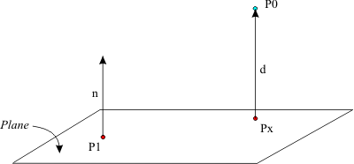

# Closest Point on Plane

Sometimes knowing if a point is on a plane or not isn't enough. Imagine your character walking in a room. You want the feet of your character to be on the floor. This is where knowing the closest point on plane helps. You can get your characters position, and the closest point on the ground plane is where you need to place him.

Technically, the we find the closest point to a plane using an orthographic projection, but there is an easyer way to understand this.



Here we have a plane with a normal N. We want to find the closest point on the plane to P0, on the image that would be Px. Take note, the point Px is some distance away from P0, but that distance is in the direciton of the normal!

The closest point on a plane will always be in the direction of the plane normal from the test point. All we have to figure out is __how far is the test point from the plane__? In the above picture, that distance is __d__.

### The algorithm

Thanks to the above image, we can deduct that given a plane, and a point, the closest point on the plane from that point will be the point minus the distance of the point from the plane in the direction of the planes normal.

The question now becomes, how do we find the distance between a point and a plane? The last section _Point on Plane_ mentioned this as the formula:

```cs
Dot(SomePoint, Normal) == Distance
```

This becomes pretty easy to implement in a function like so:

```cs
// THIS BLOCK IS JUST SAMPLE CODE, DON'T COPY IT!
Point ClosestPointOnPlane(Plane plane, Point point) {
    // This works assuming plane.Normal is normalized, which it should be
    float distance = DOT(plane.Normal, point) - plane.Distance;
    // If the plane normal wasn't normalized, we'd need this:
    // distance = distance / DOT(plane.Normal, plane.Normal);
    
    return point - distance * plane.Normal;
}
```

## On Your Own

Add the following function to the ```Collisions``` class:

```cs
public static Point ClosestPoint(Plane plane, Point point);
```

And provide an implementation for it!

### Unit Test

#TODO: Download

The following code is visual only, if you make any mistakes no error is printed!

The image is straight forward, there is a plane, the test point is red, the closest point is green. There is a blue line going from the test point to the closest point. The magenta line is the normal of the plane (rendered on top of the blue line) 


```cs
using OpenTK.Graphics.OpenGL;
using Math_Implementation;
using CollisionDetectionSelector.Primitives;

namespace CollisionDetectionSelector.Samples {
    class ClosestPointPlaneSample : Application {
        protected Vector3 cameraAngle = new Vector3(120.0f, -10f, 20.0f);
        protected float rads = (float)(System.Math.PI / 180.0f);

        Plane plane = new Plane(new Point(5, 6, 7), new Point(6, 5, 4), new Point(1, 2, 3));

        Point point = new Point(2f, 5f, -3f);

        public override void Intialize(int width, int height) {
            GL.PointSize(2f);
        }

        public override void Render() {
            Vector3 eyePos = new Vector3();
            eyePos.X = cameraAngle.Z * -(float)System.Math.Sin(cameraAngle.X * rads * (float)System.Math.Cos(cameraAngle.Y * rads));
            eyePos.Y = cameraAngle.Z * -(float)System.Math.Sin(cameraAngle.Y * rads);
            eyePos.Z = -cameraAngle.Z * (float)System.Math.Cos(cameraAngle.X * rads * (float)System.Math.Cos(cameraAngle.Y * rads));

            Matrix4 lookAt = Matrix4.LookAt(eyePos, new Vector3(0.0f, 0.0f, 0.0f), new Vector3(0.0f, 1.0f, 0.0f));
            GL.LoadMatrix(Matrix4.Transpose(lookAt).Matrix);

            DrawOrigin();

            GL.Color3(1f, 1f, 1f);
            plane.Render(4f);

            Point closest = Collisions.ClosestPoint(plane, point);
            float distance = Collisions.DistanceFromPlane(point, plane);
            Vector3 vec = point.ToVector() - plane.Normal * distance;

            GL.Color3(0f, 0f, 1f);
            GL.Begin(PrimitiveType.Lines);
            GL.Vertex3(point.X, point.Y, point.Z);
            GL.Vertex3(vec.X, vec.Y, vec.Z);
            GL.End();

            GL.Color3(1f, 0f, 1f);
            GL.Begin(PrimitiveType.Lines);
            GL.Vertex3(closest.X, closest.Y, closest.Z);
            GL.Vertex3(closest.X + plane.Normal.Z, closest.Y + plane.Normal.Y, closest.Z + plane.Normal.Z);
            GL.End();

            GL.Color3(1f, 0f, 0f);
            point.Render();

            GL.Color3(0, 1f, 0f);
            closest.Render();
        }

        public override void Update(float deltaTime) {
            cameraAngle.X += 45.0f * deltaTime;
        }

        protected void DrawOrigin() {
            GL.Begin(PrimitiveType.Lines);
            GL.Color3(1f, 0f, 0f);
            GL.Vertex3(0f, 0f, 0f);
            GL.Vertex3(1f, 0f, 0f);
            GL.Color3(0f, 1f, 0f);
            GL.Vertex3(0f, 0f, 0f);
            GL.Vertex3(0f, 1f, 0f);
            GL.Color3(0f, 0f, 1f);
            GL.Vertex3(0f, 0f, 0f);
            GL.Vertex3(0f, 0f, 1f);
            GL.End();
        }

        public override void Resize(int width, int height) {
            GL.Viewport(0, 0, width, height);
            GL.MatrixMode(MatrixMode.Projection);
            float aspect = (float)width / (float)height;
            Matrix4 perspective = Matrix4.Perspective(60, aspect, 0.01f, 1000.0f);
            GL.LoadMatrix(Matrix4.Transpose(perspective).Matrix);
            GL.MatrixMode(MatrixMode.Modelview);
            GL.LoadIdentity();
        }
    }
}
```