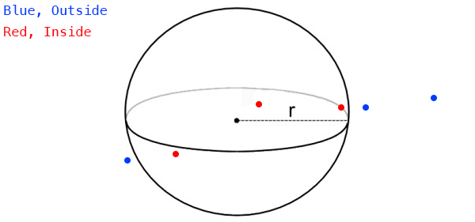

#Point in Sphere

Testing if a point is inside a sphere is one of the simplest 3D tests. Take a look at this image, and see if you can figure out the algorithm to perform the test.



### The algorithm

The actual algorithm is very simple. If the distance from the point to the center of the sphere is less than the radius of the sphere, the sphere contains the point!

### Prototype

You could achieve this by accessing the position of the sphere and point being tested as vectors. Subtract one vector from the other (order doesn't matter) and take the length of the resulting vector.

```cs
// THIS BLOCK IS JUST SAMPLE CODE, DON'T COPY IT!
function PointInSphere(Vector3 spherePos, float sphereRad, Vector3 point) {
  Vector3 difference = spherePos - point;
  float distance = Vector3.Length(difference);
  return distance < sphereRad;
}
```

That's a start, but it's a very sub-optimal way to do things. Remember, ```Vector3.Length``` requires a square root. Which is a relativley expensive operation! Before reading the next paragraph (because i will answer this question in it), how could you avoid doing a SquareRoot?

The answer is ```LengthSquared```! It's a function we implemented that does the same thing as ```Length```, minus the square root. If you are going to check the squared length, all you have to do is bring the sphere radius into square space as well. Like so:

```cs
// THIS BLOCK IS JUST SAMPLE CODE, DON'T COPY IT!
...
  float distanceSq = Vector3.LengthSquared(difference);
  return distanceSq < sphereRad * sphereRad;
```

That, is the most optimal way to check if a sphere contains a point.

### But Why?

Why do we care if a sphere contains a point? Or a bounding box contains a point? Or anything really? Triggers! You've played games where after running down an alley a cutscene triggers. Or when you enter an enemy area all the enemies attack. Perhaps running accross a bridge caused it to collapse behind you, forcing you to move forward?

How do they know you entered the enemy area? Or that you got far enough down an alley to show the cutscene? There is an invisible sphere (or box, or other geometry), they take the point in space represented by the characters world matrix and test it agains the invisible geometry. 

If the invisble geometry contains the point, it is deleted (to keep from triggering the same event twice) and the cutscene is spawned, or the enemy AI is alerted to your presence.

Of course this is a small, trivial example of where a point containment test can help, there are HUNDREDS of uses for this simple technique.

### On Your Own

We're going to keep geometry implemented as mostly data. The collision functions don't really belong inside the geometry classes.

Go ahead and implement a static ```PointInSphere``` function inside the ```Collisions``` class:

```cs
using System;
using Math_Implementation;
// If your geometry is in a namespace, pull it in

class Collisions {
    public static bool PointInSphere(Sphere sphere, Point point) {
        // TODO
        return false;
    }
}
```

### Unit Test

The sample / Unit test code for this section will be included with the next (Closest point on Sphere) sections.