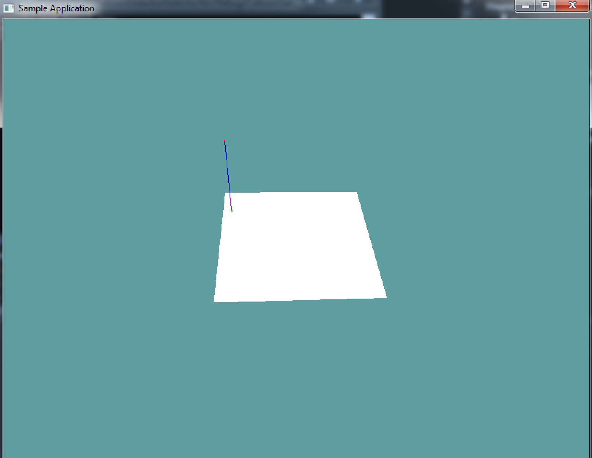

# Point On Line

Finding the closest point on a line to another point is simple vector math. Think of the line as a vector, let's call it AB. The point is another vector, C. To get the closest point on the line to the vector we simply project C onto AB. 

This works for a Line, but we don't actually have a line, we have a __line segment__. For this, you also have to interpolate the projected point. The interpolation formula is simple:

```
I(t) = START + t * (END - START)
```

```t``` in the above example is time. It's how far we've interpolated. ```I``` is the interpolation result. ```START``` and ```END``` are self explanatory. This also works with regular numbers, let's try to interpolate 25% (0.25f) between 1 and 3:

```
// Formula
I(t) = START + t * (END - START)
// Substitute start and end
I(t) = 1 + t * (3 - 1)
// Substitute t
I(0.25) = 1 + 0.25 * (3 - 1)
// Evaluate
I(0.25) = 1.5
```

This works, let's reason it out. The range from 1 to 3 is 2. So the total distance between 1 and 3 is 2. 1/4 (0.25) of 2 is .5. If we want to interpolate 25% between 1 and 3 we add .5 to 1, resulting in 1.5.

Similarly, if you wanted to interpolate 1/2 between 1 and 3, the result would be 2. This is becuase 2 is half-way between 1 and 3.

### The algorithm

The above formula will intepolate in all dimensions. Back to what i was saying, there are 3 ways to project a point (C) onto a line (AB):


In the first and last example T would be __< 0__ and __> 1__. In the middle example T is between 0 and 1. In order for the projected point to be ON THE SEGMENT, we need to clamp T between 0 and 1. 

```cs
// This is Pseudo code, the types are not 100% correct,
// that is, casting is needed. But the formula is fully 
// implemented for demonstration purposes

// Given segment AB and Point C, compute the closest point D
// on segment AB. Also return T where D(T) = A + T * (B - A)
Point ClosestPoint(Line ab, Point c, out float t) {
  // Break ab appart into components a and b
  Vector a = c.start;
  Vector b = c.end;
  
  // Project c onto ab, computing the 
  // paramaterized position d(t) = a + t * (b - a)
  t = Dot(c - a, ab) / Dot(ab, ab);
  
  // Clamp T to a 0-1 range. If t was < 0 or > 1
  // then the closest point was outside the line!
  t = Clamp(t, 0f, 1f);
  
  // Compute the projected position from the clamped t
  Point d = a + t * ab;
  
  // Return result
  return d;
}

// Provide a useful overload, we don't always care about T
Point ClosestPoint(Line ab, Point c) {
    float t = 0f;
    return ClosestPoint(ab, c, out t);
}

```

## On Your Own

Add the following functions to the ```Collisions``` class:

```cs
public static Point ClosestPoint(Line ab, Point c, out float t)
public static Point ClosestPoint(Line ab, Point c)
```

And provide an implementation for them! The second function can just call the first function. It's for conveniance, because we don't always care about t.

### Unit Test

You can [Download](../Samples/CollisionLine.rar) the samples for this chapter to see if your result looks like the unit test.

The following code is visual only, if you make any mistakes no error is printed!

The image is straight forward, there is a plane, the test point is red, the closest point is green. There is a blue line going from the test point to the closest point. The magenta line is the normal of the plane (rendered on top of the blue line) 



```cs
using OpenTK.Graphics.OpenGL;
using Math_Implementation;
using CollisionDetectionSelector.Primitives;

namespace CollisionDetectionSelector.Samples {
    class ClosestPointPlaneSample : Application {
        protected Vector3 cameraAngle = new Vector3(120.0f, -10f, 20.0f);
        protected float rads = (float)(System.Math.PI / 180.0f);

        Plane plane = new Plane(new Point(5, 6, 7), new Point(6, 5, 4), new Point(1, 2, 3));

        Point point = new Point(2f, 5f, -3f);

        public override void Intialize(int width, int height) {
            GL.PointSize(2f);
        }

        public override void Render() {
            Vector3 eyePos = new Vector3();
            eyePos.X = cameraAngle.Z * -(float)System.Math.Sin(cameraAngle.X * rads * (float)System.Math.Cos(cameraAngle.Y * rads));
            eyePos.Y = cameraAngle.Z * -(float)System.Math.Sin(cameraAngle.Y * rads);
            eyePos.Z = -cameraAngle.Z * (float)System.Math.Cos(cameraAngle.X * rads * (float)System.Math.Cos(cameraAngle.Y * rads));

            Matrix4 lookAt = Matrix4.LookAt(eyePos, new Vector3(0.0f, 0.0f, 0.0f), new Vector3(0.0f, 1.0f, 0.0f));
            GL.LoadMatrix(Matrix4.Transpose(lookAt).Matrix);

            DrawOrigin();

            GL.Color3(1f, 1f, 1f);
            plane.Render(4f);

            Point closest = Collisions.ClosestPoint(plane, point);
            float distance = Collisions.DistanceFromPlane(point, plane);
            Vector3 vec = point.ToVector() - plane.Normal * distance;

            GL.Color3(0f, 0f, 1f);
            GL.Begin(PrimitiveType.Lines);
            GL.Vertex3(point.X, point.Y, point.Z);
            GL.Vertex3(vec.X, vec.Y, vec.Z);
            GL.End();

            GL.Color3(1f, 0f, 1f);
            GL.Begin(PrimitiveType.Lines);
            GL.Vertex3(closest.X, closest.Y, closest.Z);
            GL.Vertex3(closest.X + plane.Normal.Z, closest.Y + plane.Normal.Y, closest.Z + plane.Normal.Z);
            GL.End();

            GL.Color3(1f, 0f, 0f);
            point.Render();

            GL.Color3(0, 1f, 0f);
            closest.Render();
        }

        public override void Update(float deltaTime) {
            cameraAngle.X += 45.0f * deltaTime;
        }

        protected void DrawOrigin() {
            GL.Begin(PrimitiveType.Lines);
            GL.Color3(1f, 0f, 0f);
            GL.Vertex3(0f, 0f, 0f);
            GL.Vertex3(1f, 0f, 0f);
            GL.Color3(0f, 1f, 0f);
            GL.Vertex3(0f, 0f, 0f);
            GL.Vertex3(0f, 1f, 0f);
            GL.Color3(0f, 0f, 1f);
            GL.Vertex3(0f, 0f, 0f);
            GL.Vertex3(0f, 0f, 1f);
            GL.End();
        }

        public override void Resize(int width, int height) {
            GL.Viewport(0, 0, width, height);
            GL.MatrixMode(MatrixMode.Projection);
            float aspect = (float)width / (float)height;
            Matrix4 perspective = Matrix4.Perspective(60, aspect, 0.01f, 1000.0f);
            GL.LoadMatrix(Matrix4.Transpose(perspective).Matrix);
            GL.MatrixMode(MatrixMode.Modelview);
            GL.LoadIdentity();
        }
    }
}
```