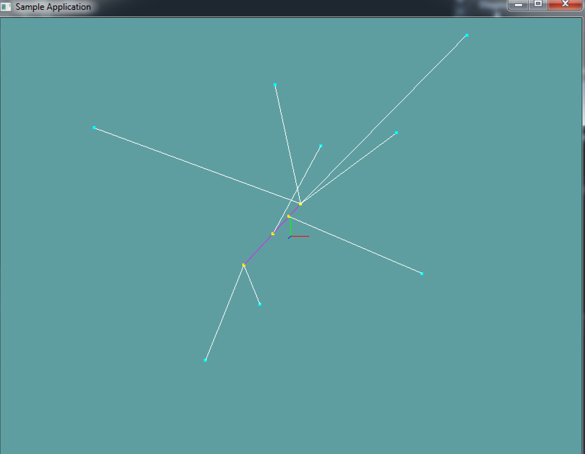

#Point on line

In order to determine if a point is on a line or not we need to know the slope intercept form of a line. That is, we need to express the line as the equation:

```
y = m * x + b
```

Im this equation m and b will be given. We plug in the X and Y position of the point being tested, if the result of the equation is true, the point will be on the line!

However, we express lines by two points, a start point and an end point. Not in slope intercept form. So we have to convert our line into said form. 

```m``` in the above equation is the slope of the line, slope is defined as rise over run, or ```rise / run```; that is, the y of the line divided by it's x. So if we convert the line to a vector (end - start), then the slope is said vectors y divided by it's x.

```
M = (line.end.y - line.start.y) / (line.end.x - line.start.x);
```


```b``` is the y-intercept. That is, it's the x value of the line where it crosses the y axis. We can find this with our slope, by subtracting the slope from the starting points y and multiplying it by the x value of the point

```
b = line.start.y - M * line.start.x;
```

If any of that is unclear, i suggest watching [this khan academy video](https://www.khanacademy.org/math/algebra-basics/core-algebra-graphing-lines-slope/core-algebra-equation-of-a-line/v/equation-of-a-line-3)

### The algorithm

Now that we can express a line in y intercept form, we can write some code to test if a point is on a line:

```
bool IsPointOnLine(Line line, Point point)  {
   float m = (line.end.y - line.start.y) / (line.end.x - line.start.x);
   float b = line.start.y - m * line.start.x;
   
   // At this point, evaluating the equation should be:
   // return point.y == m * point.x + b;
   // But that won't work, because we're working with floats
   // floating point error can accumulate, we have to use an epsilon
   
   // using an epislon, we can compare the distance of the 
   // equations result to 0 by the epsilon
   if (ABS(point.y - (m * point.x + b)) < EPSILON) {
       return true;
   }
   return false;
   
   // EPSILON is just a small number, like 0.001f;
}
```

## On Your Own

Add the following function to the ```Collisions``` class:

```cs
public static bool PointOnLine(Point point, Line line);
```

And provide an implementation for it!

### Unit Test

You can [Download](../Samples/CollisionLine.rar) the samples for this chapter to see if your result looks like the unit test.

This code doesn't spit out any errors. It's all visual. There is 1 line and several points. The points are projected to the line and lines are drawn between the points.



```cs
using OpenTK.Graphics.OpenGL;
using Math_Implementation;
using CollisionDetectionSelector.Primitives;

namespace CollisionDetectionSelector.Samples {
    class ClosestPointLine : Application {
        protected Vector3 cameraAngle = new Vector3(120.0f, -10f, 20.0f);
        protected float rads = (float)(System.Math.PI / 180.0f);

        Line testLine = new Line(new Point(-3, -2, -1), new Point(1, 2, 3));
        Point[] testPoints = new Point[] {
            new Point(7, -2, -1),
            new Point(-4, -7, -8),
            new Point(7, 8, 5),
            new Point(1, 5, -5),
            new Point(-6, 5, 7),
            new Point(1, 6, 8),
            new Point(-7, -10, -4),
            new Point(5, 5, 3)
        };

        public override void Intialize(int width, int height) {
            GL.Enable(EnableCap.DepthTest);
            GL.PointSize(4f);
        }

        public override void Render() {
            Vector3 eyePos = new Vector3();
            eyePos.X = cameraAngle.Z * -(float)System.Math.Sin(cameraAngle.X * rads * (float)System.Math.Cos(cameraAngle.Y * rads));
            eyePos.Y = cameraAngle.Z * -(float)System.Math.Sin(cameraAngle.Y * rads);
            eyePos.Z = -cameraAngle.Z * (float)System.Math.Cos(cameraAngle.X * rads * (float)System.Math.Cos(cameraAngle.Y * rads));

            Matrix4 lookAt = Matrix4.LookAt(eyePos, new Vector3(0.0f, 0.0f, 0.0f), new Vector3(0.0f, 1.0f, 0.0f));
            GL.LoadMatrix(Matrix4.Transpose(lookAt).Matrix);

            DrawOrigin();

            GL.Color3(1f, 0f, 1f);
            testLine.Render();

            GL.Color3(0f, 1f, 1f);
            foreach(Point point in testPoints) {
                point.Render();
            }

            GL.Color3(1f, 1f, 0f);
            foreach (Point point in testPoints) {
                Point closest = Collisions.ClosestPoint(testLine, point);
                closest.Render();
            }

            GL.Color3(1f, 1f, 1f);
            foreach (Point point in testPoints) {
                Point closest = Collisions.ClosestPoint(testLine, point);
                Line newLine = new Line(closest, point);
                newLine.Render();
            }
        }

        public override void Update(float deltaTime) {
            cameraAngle.X += 45.0f * deltaTime;
        }

        protected void DrawOrigin() {
            GL.Begin(PrimitiveType.Lines);
            GL.Color3(1f, 0f, 0f);
            GL.Vertex3(0f, 0f, 0f);
            GL.Vertex3(1f, 0f, 0f);
            GL.Color3(0f, 1f, 0f);
            GL.Vertex3(0f, 0f, 0f);
            GL.Vertex3(0f, 1f, 0f);
            GL.Color3(0f, 0f, 1f);
            GL.Vertex3(0f, 0f, 0f);
            GL.Vertex3(0f, 0f, 1f);
            GL.End();
        }

        public override void Resize(int width, int height) {
            GL.Viewport(0, 0, width, height);
            GL.MatrixMode(MatrixMode.Projection);
            float aspect = (float)width / (float)height;
            Matrix4 perspective = Matrix4.Perspective(60, aspect, 0.01f, 1000.0f);
            GL.LoadMatrix(Matrix4.Transpose(perspective).Matrix);
            GL.MatrixMode(MatrixMode.Modelview);
            GL.LoadIdentity();
        }
    }
}
```