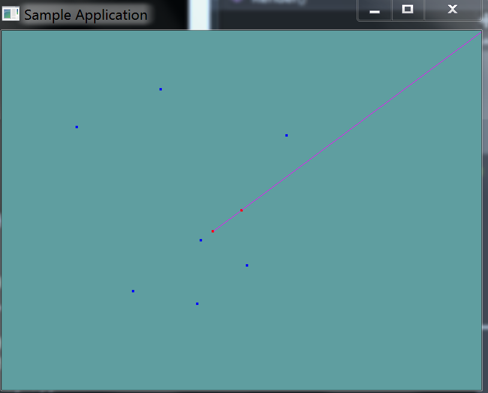

#Point on ray

Determining if a point is on a ray or not comes down to the dot product. The key here is to realize that given the direction of the ray we have a normal vector. If we subtract the point from the ray, and normalize the resuling vector, we have a normal from the origin of the ray to the test point. At this point we have two normals. Remember, the dot product of two normals is:

* __0__ if the two vectors point in the same direction
* __positive__ if TODO
* __negative__ if TODO

Of course you need to use a very small epsilon here, because of floating point error. 

Now, there is one edge case to all this. What happens if the point we are testing and the origin of the ray are the same point? Well, the dot product breaks down and we get no new normal vector. But that point is on the ray. You should add a special case if check for that.

See if you can implement this on your own before looking at the code below.

### The algorithm

Implementing the above in code is fairly straight forward:

```
public static bool PointOnRay(Point point, Ray ray) {
    // If point and ray are the same, return true
    
    Vector3 newNorm = point - ray.Position;
    newNorm.Normalize();
    
    float d = Vector3.Dot(newNorm, ray.Normal);
    return Math.Abs(1f - d) < 0.000001f; // SUPER SMALL EPSILON!
}
```

## On Your Own

Add the following function to the ```Collisions``` class:

```cs
public static bool PointOnRay(Point point, Ray ray)
```

And provide an implementation for it!

### Unit Test

You can [Download](../Samples/CollisionRay.rar) the samples for this chapter to see if your result looks like the unit test.

The constructor of this code will spit out errors if they are present. A ray is rendered, along with a random sampling of points. Any point that falls on the ray is rendered in red, points not on the ray are rendered in blue.



```cs
using OpenTK.Graphics.OpenGL;
using Math_Implementation;
using CollisionDetectionSelector.Primitives;

namespace CollisionDetectionSelector.Samples {
    class PointOnray : Application {
        protected Vector3 cameraAngle = new Vector3(120.0f, -10f, 20.0f);
        protected float rads = (float)(System.Math.PI / 180.0f);

        Ray testRay = new Ray(new Point(-3, -2, -1), new Vector3(3, 2, 1));
        Point[] testPoints = new Point[] {
            new Point(-3, -2, -1),
            new Point(12, 8, 4),
            new Point(0, 0, 0),
            new Point(-18, -12, -6),
            new Point(-4, -7, -8),
            new Point(7, 8, 5),
            new Point(1, 5, -5),
            new Point(-6, 5, 7),
            new Point(1, 6, 8),
            new Point(-7, -10, -4),
            new Point(-4.5f, -3f, -1.5f)
        };

        public override void Intialize(int width, int height) {
            GL.Enable(EnableCap.DepthTest);
            GL.PointSize(4f);

            for (int i = 0; i < 3; ++i) {
                if (!Collisions.PointOnRay(testPoints[i], testRay)) {
                    System.Console.ForegroundColor = System.ConsoleColor.Red;
                    System.Console.WriteLine("Expected point: " + testPoints[i].ToString() + " to be on Ray!");
                }
            }

            for (int i = 3; i < testPoints.Length; ++i) {
                if (Collisions.PointOnRay(testPoints[i], testRay)) {
                    System.Console.ForegroundColor = System.ConsoleColor.Red;
                    System.Console.WriteLine("Expected point: " + testPoints[i].ToString() + " to NOT be on Ray!");
                }
            }
        }

        public override void Render() {
            Vector3 eyePos = new Vector3();
            eyePos.X = cameraAngle.Z * -(float)System.Math.Sin(cameraAngle.X * rads * (float)System.Math.Cos(cameraAngle.Y * rads));
            eyePos.Y = cameraAngle.Z * -(float)System.Math.Sin(cameraAngle.Y * rads);
            eyePos.Z = -cameraAngle.Z * (float)System.Math.Cos(cameraAngle.X * rads * (float)System.Math.Cos(cameraAngle.Y * rads));

            Matrix4 lookAt = Matrix4.LookAt(eyePos, new Vector3(0.0f, 0.0f, 0.0f), new Vector3(0.0f, 1.0f, 0.0f));
            GL.LoadMatrix(Matrix4.Transpose(lookAt).Matrix);

            GL.Color3(1f, 0f, 1f);
            testRay.Render();

            foreach (Point point in testPoints) {
                if (Collisions.PointOnRay(point, testRay)) {
                    GL.Color3(1f, 0f, 0f);
                }
                else {
                    GL.Color3(0f, 0f, 1f);
                }
                point.Render();
            }
        }

        public override void Update(float deltaTime) {
            cameraAngle.X += 45.0f * deltaTime;
        }

        public override void Resize(int width, int height) {
            GL.Viewport(0, 0, width, height);
            GL.MatrixMode(MatrixMode.Projection);
            float aspect = (float)width / (float)height;
            Matrix4 perspective = Matrix4.Perspective(60, aspect, 0.01f, 1000.0f);
            GL.LoadMatrix(Matrix4.Transpose(perspective).Matrix);
            GL.MatrixMode(MatrixMode.Modelview);
            GL.LoadIdentity();
        }
    }
}
```