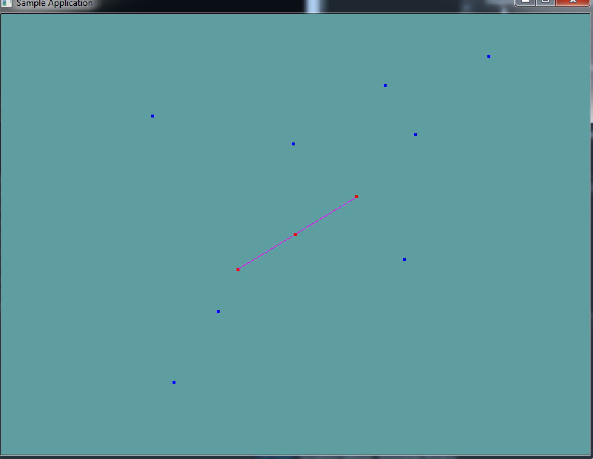

#Point on ray

Determining if a point is on a ray or not comes down to the dot product. The key here is to realize that given the direction of the ray we have a normal vector. If we subtract the point from the ray, and normalize the resuling vector, we have a normal from the origin of the ray to the test point. At this point we have two normals. Remember, the dot product of two normals is:

* __0__ if the two vectors point in the same direction
* __positive__ if TODO
* __negative__ if TODO

Of course you need to use a very small epsilon here, because of floating point error. See if you can implement this on your own before looking at the code below

### The algorithm

Implementing the above in code is fairly straight forward:

```
public static Point ClosestPoint(Ray r, Point c) {
        Line ab = new Line(r.Position, new Point(r.Position.ToVector() + r.Normal));
        Vector3 a = r.Position.ToVector();
        Vector3 b = r.Position.ToVector() + r.Normal;
        float t = Vector3.Dot(c.ToVector() - a, ab.ToVector()) / Vector3.Dot(ab.ToVector(), ab.ToVector());
        t = Math.Max(t, 0f);
        return new Point(a + r.Normal * t);
    }
```

## On Your Own

Add the following function to the ```Collisions``` class:

```cs
public static Point ClosestPoint(Ray r, Point c)
```

And provide an implementation for it!

### Unit Test

You can [Download](../Samples/CollisionLine.rar) the samples for this chapter to see if your result looks like the unit test.

The constructor of this code will spit out errors if they are present. A line is rendered, along with a random sampling of points. Any point that falls on the line is rendered in red, points not on the line are rendered in blue.



```cs
using OpenTK.Graphics.OpenGL;
using Math_Implementation;
using CollisionDetectionSelector.Primitives;

namespace CollisionDetectionSelector.Samples {
    class PointOnLine : Application {
        protected Vector3 cameraAngle = new Vector3(120.0f, -10f, 20.0f);
        protected float rads = (float)(System.Math.PI / 180.0f);

        Line testLine = new Line(new Point(-3, -2, -1), new Point(3, 2, 1));
        Point[] testPoints = new Point[] {
            new Point(0, 0, 0),
            new Point(-3, -2, -1),
            new Point(3, 2, 1),
            new Point(7, -2, -1),
            new Point(-4, -7, -8),
            new Point(7, 8, 5),
            new Point(1, 5, -5),
            new Point(-6, 5, 7),
            new Point(1, 6, 8),
            new Point(-7, -10, -4),
            new Point(5, 5, 3)
        };

        public override void Intialize(int width, int height) {
            GL.Enable(EnableCap.DepthTest);
            GL.PointSize(4f);

            for (int i = 0; i < 3; ++i) {
                if (!Collisions.PointOnLine(testPoints[i], testLine)) {
                    System.Console.ForegroundColor = System.ConsoleColor.Red;
                    System.Console.WriteLine("Expected point: " + testPoints[i].ToString() + " to be on Line!");
                }
            }

            for (int i = 3; i < testPoints.Length; ++i) {
                if (Collisions.PointOnLine(testPoints[i], testLine)) {
                    System.Console.ForegroundColor = System.ConsoleColor.Red;
                    System.Console.WriteLine("Expected point: " + testPoints[i].ToString() + " to be on Line!");
                }
            }
        }

        public override void Render() {
            Vector3 eyePos = new Vector3();
            eyePos.X = cameraAngle.Z * -(float)System.Math.Sin(cameraAngle.X * rads * (float)System.Math.Cos(cameraAngle.Y * rads));
            eyePos.Y = cameraAngle.Z * -(float)System.Math.Sin(cameraAngle.Y * rads);
            eyePos.Z = -cameraAngle.Z * (float)System.Math.Cos(cameraAngle.X * rads * (float)System.Math.Cos(cameraAngle.Y * rads));

            Matrix4 lookAt = Matrix4.LookAt(eyePos, new Vector3(0.0f, 0.0f, 0.0f), new Vector3(0.0f, 1.0f, 0.0f));
            GL.LoadMatrix(Matrix4.Transpose(lookAt).Matrix);

            GL.Color3(1f, 0f, 1f);
            testLine.Render();

            foreach (Point point in testPoints) {
                if (Collisions.PointOnLine(point, testLine)) {
                    GL.Color3(1f, 0f, 0f);
                }
                else {
                    GL.Color3(0f, 0f, 1f);
                }
                point.Render();
            }
        }

        public override void Update(float deltaTime) {
            cameraAngle.X += 45.0f * deltaTime;
        }

        public override void Resize(int width, int height) {
            GL.Viewport(0, 0, width, height);
            GL.MatrixMode(MatrixMode.Projection);
            float aspect = (float)width / (float)height;
            Matrix4 perspective = Matrix4.Perspective(60, aspect, 0.01f, 1000.0f);
            GL.LoadMatrix(Matrix4.Transpose(perspective).Matrix);
            GL.MatrixMode(MatrixMode.Modelview);
            GL.LoadIdentity();
        }
    }
}
```