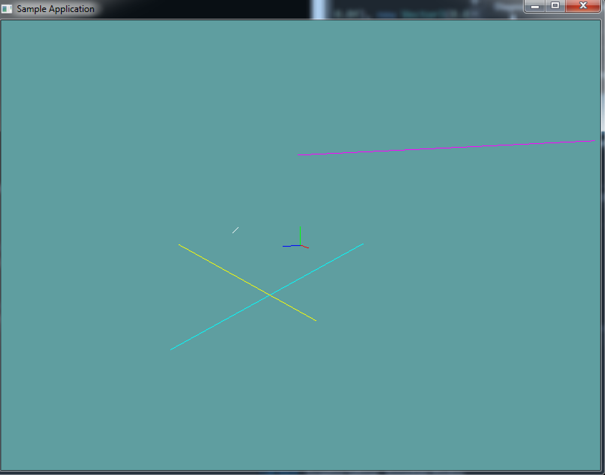

#Ray 

A ray is similar to a line (not line segment). A ray is a single point in space with a direction. It extends infinatley far away in that single direction (as opposed to a line, which extends in both directions).

With the above definition, the code for a ray is pretty simple:

```cs
class Ray {
    public Point position;
    public Vector3 direction;
}
```

Much like line segments, rays are fairly straight forward objets. Because i ray is a directed line (not line segment tough), a lot of the collision code is going to be very similar to that of a line.

### Code Guide

The ```Ray``` class is straight forward. You can follow this guide for implementation, or make your own. Notably, i made the direction a private member called ```_normal```. I do this to ensure that it is normalized at all times. You might want to do that differently, this means you can't to this in my code:

```
ray.Normal.X = 7;
```

The reason i'm ok with that is you rarley set only a single component of a normal! More often than not you must set the whole normal anyway.

```cs
using System;
using OpenTK.Graphics.OpenGL;
using Math_Implementation;

namespace CollisionDetectionSelector.Primitives {
    class Ray {
        public Point Position;
        private Vector3 _normal;

        public Vector3 Normal {
            get {
                // TODO: Returns _normal
                return _normal;
            }
            set {
                // TODO: Sets (and normalizes) _normal
                _normal = value;
                _normal.Normalize();
            }
        }

        public Ray() {
            // Make a ray that is at origin, 
            // pointing down the Z axis
            Position = new Point(0, 0, 0);
            _normal = new Vector3(0, 0, 1);
        }

        public Ray(Point p, Vector3 d) {
            // Don't forget to normalize _normal
            Position = new Point(p.X, p.Y, p.Z);
            _normal = new Vector3(d.X, d.Y, d.Z);
            _normal.Normalize();
        }

        public Ray(Vector3 p, Vector3 d) {
            // Don't forget to normalize _normal
            Position = new Point(p.X, p.Y, p.Z);
            _normal = new Vector3(d.X, d.Y, d.Z);
            _normal.Normalize();
        }

        //Render and toString must be there!
        public void Render() {
            GL.Begin(PrimitiveType.Lines);
            Vector3 start = Position.ToVector();
            Vector3 end = start + _normal * 5000f;
            GL.Vertex3(start.X, start.Y, start.Z);
            GL.Vertex3(end.X, end.Y, end.Z);
            GL.End();
        }

        public override string ToString() {
            string result = "P: (" + Position.X + ", " + Position.Y + ", " + Position.Z + "), ";
            result += "D: ( " + _normal.X + ", " + _normal.Y + ", " + _normal.Z + ")";
            return result;
        }
    }
}
```

## On Your Own

Implement the Ray class. You can use the code guide above, or use your own implementation

### Sample / Unit Test

You can [Download](../Samples/CollisionRay.rar) the samples for this chapter to see if your result looks like the unit test.

This example is visual only, no errors will be printed to the console if the code is bad. This is what the final render should look like:



```cs

```