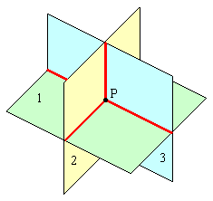

# 3 Plane Intersection

Planes have a pretty special property. Given 3 unique planes, they intersect at exactly one point!



Any 3 dimensional cordinate system has 3 axis (x, y, z) which can be represented by 3 planes. Where those axis meet is considered (0, 0, 0) or the origin of the coordinate space.

Other than debug visualization, i've never used this intersection test in production. But it's useful to know in order to visualize some debug properties.

### The algorithm

I don't fully understand this algorithm, usually i copy it out of a book. In that spirit, i'm just going to go ahead and provide it:

```cs
Point IntersectPlanes(Plane p1, Plane p2, Plane p3) {
    Vector m1 = new Vector(p1.Normal.X, p2.Normal.X, p3.Normal.X);
    Vector m2 = new Vector(p1.Normal.Y, p2.Normal.Y, p3.Normal.Y);
    Vector m3 = new Vector(p1.Normal.Z, p2.Normal.Z, p3.Normal.Z);
    Vector d = new Vector(p1.Distance, P2.Distance, P3.Distance);
    
    Vector u = Cross(m2, m3);
    Vector v =Cross (m1, d);
    
    float demon = Dot(m1, u);
    
    if (Abs(denom) < EPSILON) {
        // Planes don't actually intersect in a point
        // Throw exception maybe?
        return new Point(0, 0, 0);
    }
       
    return new Point(
        Dot(d, u) / denom,
        Dot(m3, v) / denom,
        -Dot(m2, v) / denom
    );
}
```

Of course, there are ways for 3 planes to intersect that do not end in a point:

In that case we just return 0, but it might be appropriate to throw an exception. Or it might not, depends on what you use this function for!