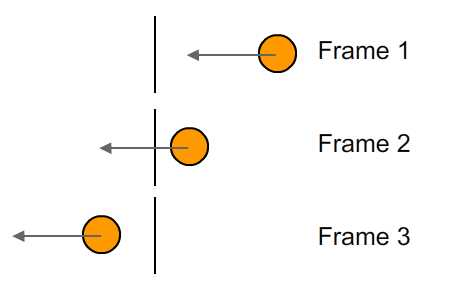

# Dynamic Intersections

Finding the collision between dynamic moving objects is a bit tougher than finding the collision between static objects. This is because of tunneling. Read [this article](https://www.aorensoftware.com/blog/2011/06/01/when-bullets-move-too-fast/) for a bit more in depth information on the problem.

Let's take a look at the problem using this image:

The object is moving a consistent amount of space each frame. The problem is, it moves right past the plane! So a Sphere to Plane intersection (the way we know it) will not catch this collision! 

Now, imagine turning that image 90 degrees to the left, the plane is the ground plane and the sphere is falling. It never hits the ground!

### Special Case

The sphere tunneling test has a simple solution, but the more complex the shape, the harder the solution. __In this chapter__ we are going to cover dynamic collisions of specific shapes that have trivial solutions. 

This __will not__ be as comprehensive a list of collisions as the dynamic ones. Because at some point you have to start getting crazy! But sometimes that is the solution. Detecting tunneling is a problem of logic, there is no standard algorithm.

Think about a moving AABB and a plane. You'd have to make a line from every vertex of the AABB in it's starting position to every vertex in it's end position, then you'd have to compare those 4 lines against the plane. If any of those 4 lines are intersecting the plane, but the aabb in it's final position is not, you have tunneling!

Knowing that you've tunneled will let you correct it. However, we are __not__ going to cover the logic for tunel detection and correction of complex shapes. That's the kind of stuff you have to learn to figure out in the moment.

### No Code

We are not going to write any code in this chapter. Collision resolution of dynamic objects is complex, it's often handled by a physics system.

Realistically, this is not a skill you are going to use, just understanding how it works is enough.