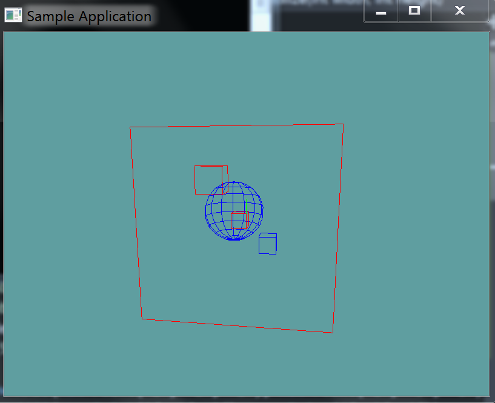

# Sphere AABB Intersection

Testing whether a sphere intersects an axis-aligned bounding box is best done by computing the distance between the sphere center and the AABB. This is done using the "Closest Point To AABB" function, with the sphere center being the point. 

Once you have the closest point compare its distance with the radius of the sphere. ```Distance = Sphere.Position - ClosestPoint``` If the distance is less than the radius,
the sphere and AABB must be intersecting. 

To avoid expensive square root operations, both distance and radius can be squared before the comparison is made without
changing the result of the test.

## The Algorithm

Again, this is pseudo-code. The types might not match up to what you expect them to be.

```cs
bool Intersects(Sphere sphere, AABB aabb) {
    Vector3 closestPoint = ClosestPoint(aabb, sphere.Position);
    Vector3 differenceVec = sphere.Position - closestPoint;

    float distanceSquared = Vector3.LengthSquared(differenceVec);
    float radiusSquared = sphere.Radius * sphere.Radius;

    return distanceSquared < radiusSquared;
}
```

## On Your Own

Add the following function to the ```Collisions``` class:

```cs
// TODO: Implement this
public static bool Intersects(Sphere sphere, AABB aabb)

// Just a conveniance function, so argument order wont matter!
public static bool Intersects(AABB aabb, Sphere sphere) {
    return Intersection(sphere, aabb);
}
```

And provide an implementation for it!

### Unit Test

You can [Download](../Samples/StaticIntersections.rar) the samples for this chapter to see if your result looks like the unit test.

This unit tests will spit out some errors in the constructor if your intersection code is returning the wrong values. There is a blue sphere rendered and 4 cubes. 3 of the cubes intersect the sphere. Any intersecting cubes are rendered red, while non-intersecting ones are rendered blue.



```cs
code
```