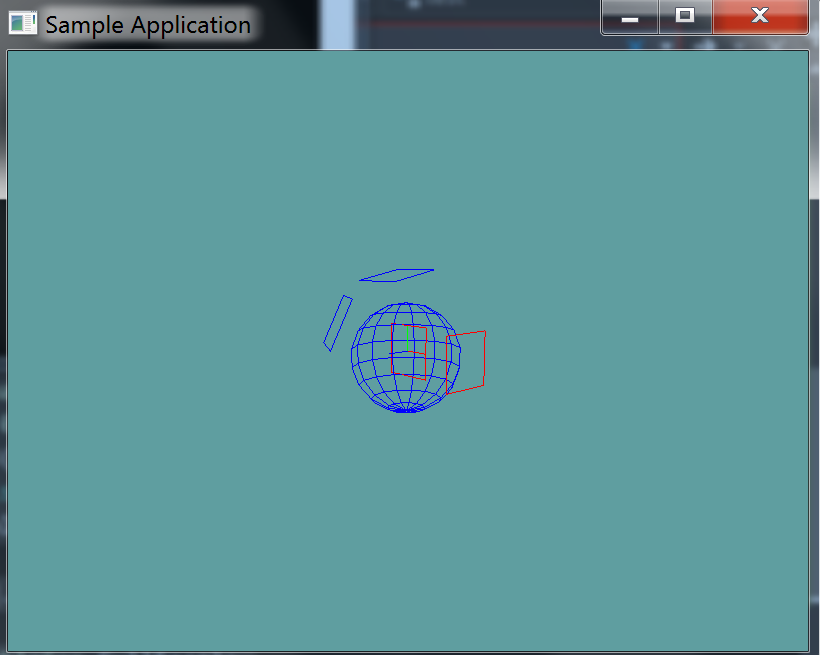

# Sphere Plane Intersection

This is a pretty simple intersection logic, like with the Sphere-AABB intersection, we've already written the basic checks to support it. To see if a sphere and plane intersect:

1. Find the closest point on the plane to the sphere
2. Make sure the distance of that point is <= than the sphere radius

That's it. Of course you might want to check length squared against radius squared to save on some performance.

## The Algorithm

This is a super simple algorithm (about 3 lines), try implementing it without a code guide.

## On Your Own

Add the following function to the ```Collisions``` class:

```cs
// TODO: Provide implementation
public static bool Intersects(Sphere sphere, Plane plane) 

// Conveniance function
public static bool Intersects(Plane plane, Sphere sphere) {
    return Intersects(sphere, plane);
}
```

And provide an implementation for it!

### Unit Test

You can [Download](../Samples/StaticIntersections.rar) the samples for this chapter to see if your result looks like the unit test.

This unit test will spit out minimal errors if your collision results are not as expected. It will render a blue sphere and several planes. Planes that intersect the sphere are rendered in red, planes that don't are rendered in blue. 



```cs
using OpenTK.Graphics.OpenGL;
using Math_Implementation;
using CollisionDetectionSelector.Primitives;

namespace CollisionDetectionSelector.Samples {
    class SpherePlaneIntersection : Application {
        Sphere test = new Sphere(new Point(1f, 0f, 1f), 2f);

        Plane[] planes = new Plane[] {
            null, null, null, null, null // Size = 5
        };

        public override void Intialize(int width, int height) {
            GL.Enable(EnableCap.DepthTest);
            GL.Enable(EnableCap.CullFace);
            GL.PolygonMode(MaterialFace.FrontAndBack, PolygonMode.Line);
            GL.PointSize(5f);

            planes[0] = new Plane();
            planes[1] = new Plane(new Vector3(0f, 1f, 0.2f), 3f);
            planes[2] = new Plane(new Vector3(0f, 1f, 0f), -2f);
            planes[3] = new Plane(new Vector3(-1f, 1f, 2f), 3f);
            planes[4] = new Plane(new Vector3(1f, 0f, 0f), 3f);

            bool[] results = new bool[] {
                true, false, true, false, true
            };
            int t = 0;

            for (int i = 0; i < planes.Length; ++i) {
                if (Collisions.Intersects(planes[i], test) != results[t++]) {
                    LogError("Expected plane " + i + " to " +
                        (results[t - 1] ? "intersect" : "not intersect") +
                    " the sphere");
                }
            }
        }

        public override void Render() {
            base.Render();
            DrawOrigin();

            GL.Disable(EnableCap.CullFace);
            for (int i = 0; i < planes.Length; ++i) {
                GL.Color3(0f, 0f, 1f);
                if (Collisions.Intersects(test, planes[i])) {
                    GL.Color3(1f, 0f, 0f);
                }
                planes[i].Render();
            }
            GL.Enable(EnableCap.CullFace);

            GL.Color3(0f, 0f, 1f);
            test.Render();
        }
    }
}
```