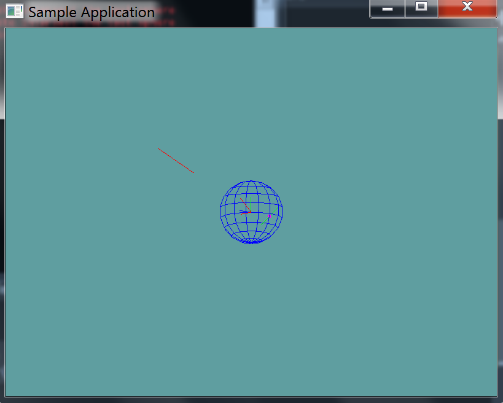

#Line Against AABB

The code for Line V AABB is almost the same as the code for Line V Sphere. Both functions are wrappers around a ray cast.

This test will __test intersection__, it will __not test containment__. That is, if you have a line, and both start and end points are INSIDE the sphere, the result of this test will be false!

### Implementation

```cs
public static bool LineTest(Line line, Sphere sphere, out Point result) {
    // First, create a ray from p0 to p1
    Ray ray = new Ray();
    ray.Position = line.start; // by reference, that's ok
    // Normal points from start to end, by value.
    // The Normal setter will automatically normalize this
    ray.Normal = (line.end.ToVector() - line.start.ToVector());

    // Not do the actual ray cast
    float t = -1;
    if (!Raycast(ray, sphere, out t)) {
        // If the raycast returns false, the point was never on the line!
        result = new Point(0f, 0f, 0f);
        return false;
    }

    // If t is less than 0, the point is behind the start point
    if (t < 0) {
        // By value! Call new to make a new point, don't want to assigne a reference
        result = new Point(line.start.ToVector());
        return false;
    }
    // Optimize by checking length squared instead of length!
    // if t is greater than the length of the line, intersection is after start point
    else if (t * t > line.LengthSquared) {
        result = new Point(line.end.ToVector()); // Again, by value!
        return false;
    }

    // If we made it here, the line intersected the sphere
    result = new Point(ray.Position.ToVector() + ray.Normal * t);
    return true;
}
```

### Unit Test

This unit test will print out errors if any are present in your code.



```cs
using OpenTK.Graphics.OpenGL;
using Math_Implementation;
using CollisionDetectionSelector.Primitives;

namespace CollisionDetectionSelector.Samples {
    class LinetestSphere : Application {
        public Line[] lines = new Line[] {
            new Line(new Point(2.5f, 2.5f, 2.5f), new Point(4, 4, 4)), // false
            new Line(new Point(1f, 1f, 0f), new Point(0f, 0f, 0f)), // false
            new Line(new Point(-1f, -1f, 0f), new Point(-3f, 0f, 0f)), // true
        };
        public Sphere sphere = new Sphere();

        public override void Intialize(int width, int height) {
            GL.Enable(EnableCap.DepthTest);
            GL.PointSize(5f);
            GL.Enable(EnableCap.CullFace);
            GL.PolygonMode(MaterialFace.FrontAndBack, PolygonMode.Line);

            sphere.Position = new Point(0f, 0f, 0f);
            sphere.Radius = 2;

            bool[] results = new bool[] { false, false, true };
            for (int i = 0; i < results.Length; ++i) {
                LogError("Line at index " + i + " was " +
                    (results[i]? "expected" : "not expected") +
                    "to intersect the test sphere");
            }
        }

        public override void Render() {
            base.Render();
            DrawOrigin();

            Point result = new Point();
            foreach (Line line in lines) {
                if (Collisions.LineTest(line, sphere, out result)) {
                    GL.Color3(1f, 0f, 1f);
                    result.Render();
                    GL.Color3(0f, 2f, 0f);
                }
                else {
                    GL.Color3(1f, 0f, 0f);
                }
                line.Render();
            }

            GL.Color3(0f, 0f, 1f);
            sphere.Render();
        }

        private void Log(string s) {
            System.Console.WriteLine(s);
        }
    }
}
```