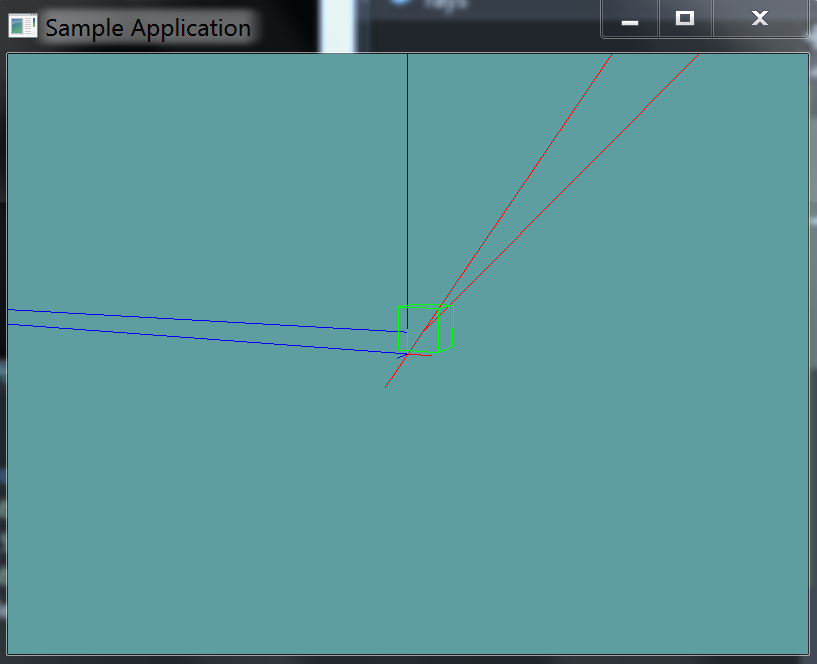

# Raycast AABB

Raycasting an AABB is often done trough an algorithm called __Cyrus-Beck clipping__. You can read more about it [here](https://izzofinal.wordpress.com/2012/11/09/ray-vs-box-round-1/) and [here](http://gamedev.stackexchange.com/questions/18436/most-efficient-aabb-vs-ray-collision-algorithms). Because a ray that enters a box will intersect it twice, this algorithm gives both T1 and T2. We only care about the closer t value.

This algorithm works by clipping a ray against a plane. We know that an AABB has 6 sides, it's made out of 6 planes. It has 3 pairs of parallel planes (left and right, top and bottom, front and back).

When we break the box up into 3 pairs of parallel planes we actually break it down into orthagonal planes, defined by a single axis! That is to say:

```
Left plane = aabb.min.x
Right plane = aabb.max.x
```

Now then, a point along the ray is represented as:

```
point = ray.origin + t * ray.direction
```

Where t is some time along the ray. We can break this down into it's indevidual components:

```
point.x = ray.origin.x + t * ray.direction.x
point.y = ray.origin.y + t * ray.direction.y
point.z = ray.origin.z + t * ray.direction.z
```

Next, we can simply re-arrange this formula, to solve for t, rather than an unknown 3D point.

```
t = (point.x – ray.origin.x) / ray.direction.x
t = (point.y – ray.origin.y) / ray.direction.y
t = (point.z – ray.origin.z) / ray.direction.z
```

Finally, we substitute point, the unknown for a component of our perpendicular plane!

```
tMinX = (aabb.min.x – ray.origin.x) / ray.direction.x
tMaxX = (aabb.max.y – ray.origin.x) / ray.direction.x
// Same for y and z
```

At this point we have 6 min and max values, tMinX, tMinY, tMinZ, tMaxX, tMaxY, tMaxZ. How do we find just tMin and tMax? Find the MAXIMUM tMin and the MINIMUM tFar.

```
// The BIGGEST MIN value
tMin = Max( // Whats bigger [minX/minY] or MinZ
          Max( // What's bigger, minX or minY
            Min(tMinX, tMaxX), // Get the smaller X
            Min(tMinY, tMaxY) // Get teh smaller Y
          ), 
          Min(tMinZ, tMaxZ) // Get the smaller Z
        );

// The SMALLEST MAX value
tMax = Min( 
          Min( // Whats smaller [minX/minY] or MinZ
            Max(tMinX, tMaxX),  // Get the bigger X
            Max(tMinY, tMaxY)  // Get teh bigger Y
          ), 
          Max(tMinZ, tMaxZ) // Get the bigger Z
        );
```

Thats it! If tMax is less than 0, then the ray is intersecting the AABB, but before the origin of the ray. So, it's not a collision! (t would be negative)

If tMin is less than tMax, then there is no collision. These images demonstrate why:


You want to return tMin as t, becuase it's smalelr, it's closer on our ray

## The Algorithm

```cs
code
```

## On Your Own

Add the following function to the ```Collisions``` class:

```cs
code
```

And provide an implementation for it!

### Unit Test

You can [Download](../Samples/Raycast.rar) the samples for this chapter to see if your result looks like the unit test.

description of unit test



```cs
code
```