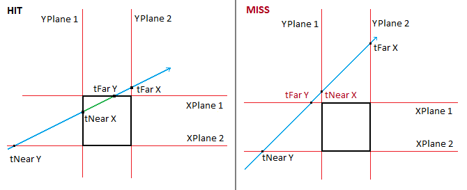

# Raycast AABB

Raycasting an AABB is often done trough an algorithm called __Cyrus-Beck clipping__. You can read more about it [here](https://izzofinal.wordpress.com/2012/11/09/ray-vs-box-round-1/) and [here](http://gamedev.stackexchange.com/questions/18436/most-efficient-aabb-vs-ray-collision-algorithms). Because a ray that enters a box will intersect it twice, this algorithm gives both T1 and T2. We only care about the closer t value.

This algorithm works by clipping a ray against a plane. We know that an AABB has 6 sides, it's made out of 6 planes. It has 3 pairs of parallel planes (left and right, top and bottom, front and back).

When we break the box up into 3 pairs of parallel planes we actually break it down into orthagonal planes, defined by a single axis! That is to say:

```
Left plane = aabb.min.x
Right plane = aabb.max.x
```

Now then, a point along the ray is represented as:

```
point = ray.origin + t * ray.direction
```

Where t is some time along the ray. We can break this down into it's indevidual components:

```
point.x = ray.origin.x + t * ray.direction.x
point.y = ray.origin.y + t * ray.direction.y
point.z = ray.origin.z + t * ray.direction.z
```

Next, we can simply re-arrange this formula, to solve for t, rather than an unknown 3D point.

```
t = (point.x – ray.origin.x) / ray.direction.x
t = (point.y – ray.origin.y) / ray.direction.y
t = (point.z – ray.origin.z) / ray.direction.z
```

Finally, we substitute point, the unknown for a component of our perpendicular plane!

```
tMinX = (aabb.min.x – ray.origin.x) / ray.direction.x
tMaxX = (aabb.max.y – ray.origin.x) / ray.direction.x
// Same for y and z
```

At this point we have 6 min and max values, tMinX, tMinY, tMinZ, tMaxX, tMaxY, tMaxZ. How do we find just tMin and tMax? Find the MAXIMUM tMin and the MINIMUM tFar.

```
// The BIGGEST MIN value
tMin = Max( // Whats bigger [minX/minY] or MinZ
          Max( // What's bigger, minX or minY
            Min(tMinX, tMaxX), // Get the smaller X
            Min(tMinY, tMaxY) // Get teh smaller Y
          ), 
          Min(tMinZ, tMaxZ) // Get the smaller Z
        );

// The SMALLEST MAX value
tMax = Min( 
          Min( // Whats smaller [minX/minY] or MinZ
            Max(tMinX, tMaxX),  // Get the bigger X
            Max(tMinY, tMaxY)  // Get teh bigger Y
          ), 
          Max(tMinZ, tMaxZ) // Get the bigger Z
        );
```

Thats it! If tMax is less than 0, then the ray is intersecting the AABB, but before the origin of the ray. So, it's not a collision! (t would be negative)

If tMin is less than tMax, then there is no collision. These images demonstrate why:



You want to return tMin as t, becuase it's smalelr, it's closer on our ray. Except if tMin is less than 0, in that case, you want to return tMax.

## The Algorithm

```cs
// Given a ray and an aabb:
// return t at which the ray intersects the aabb. 
// return -1 if there is no intersection
public static float Raycast(Ray ray, AABB aabb) {
    float t1 = (aabb.minX - ray.Position.X) / ray.Normal.X;
    float t2 = (aabb.maxX - ray.Position.X) / ray.Normal.X;
    float t3 = (aabb.minY - ray.Position.Y) / ray.Normal.Y;
    float t4 = (aabb.maxY - ray.Position.Y) / ray.Normal.Y;
    float t5 = (aabb.minZ - ray.Position.Z) / ray.Normal.Z;
    float t6 = (aabb.maxZ - ray.Position.Z) / ray.Normal.Z;

    float tmin = Max(Max(Min(t1, t2), Min(t3, t4)), Min(t5, t6));
    float tmax = Min(Min(Max(t1, t2), Max(t3, t4)), Max(t5, t6));

    // if tmax < 0, ray (line) is intersecting AABB, but whole AABB is behing us
    if (tmax < 0) {
        return -1;
    }

    // if tmin > tmax, ray doesn't intersect AABB
    if (tmin > tmax) {
        return -1
    }
    
    if (tmin < 0f) {
        return tmax;
    }
    return tmin;
}
```

## On Your Own

Add the following function to the ```Collisions``` class:

```cs
// TODO: Implement ONLY THIS ONE method:
public static bool Raycast(Ray ray, AABB aabb, out float t)


// I've implemented the blow methods for you.
// Nothing to do past this point

public static float Raycast(Ray ray, AABB aabb) {
    float t = -1;
    if (!Raycast(ray, aabb, out t)) {
        return -1;
    }
    return t;
}

public static bool Raycast(Ray ray, AABB aabb, out Point p) {
    float t = -1;
    bool result = Raycast(ray, aabb, out t);
    p = new Point(ray.Position.ToVector() + ray.Normal * t);
    return result;
}
```

And provide an implementation for it!

### Unit Test

You can [Download](../Samples/Raycast.rar) the samples for this chapter to see if your result looks like the unit test.

This unit test will render an AABB on screen, and several rays. If any rays intersect the AABB they will render red, otherwise blue.

The constructor of the unit test will spit out errors if the test results are not what are expected.


```cs
using OpenTK.Graphics.OpenGL;
using Math_Implementation;
using CollisionDetectionSelector.Primitives;

namespace CollisionDetectionSelector.Samples {
    class RaycastAABB : Application {
        public AABB test = new AABB(new Point(0.5f, 0.5f, 0.5f), new Point(2f, 2f, 2f));

        public Ray[] rays = new Ray[] {
            new Ray(new Point(-2, -2, -2), new Vector3(2, 2, 2)),
            new Ray(new Point(0f, 0f, 0f), new Vector3(0f, 1f, 0f)),
            new Ray(new Point(0f, 0f, 0f), new Vector3(-1f, 0f, 0f)),
            new Ray(new Point(1f, 1f, 1f), new Vector3(1f, 1f, 0f)),
            new Ray(new Point(0.4f, 1f, 1f), new Vector3(-1f, 0f, 0f)),
        };

        public override void Intialize(int width, int height) {
            GL.Enable(EnableCap.DepthTest);
            GL.PointSize(5f);
            GL.Enable(EnableCap.CullFace);
            GL.PolygonMode(MaterialFace.FrontAndBack, PolygonMode.Line);

            bool[] results = new bool[] {
                true, false, false, true, false
            };

            float t;
            for (int i = 0; i < results.Length; ++i) {
                if (Collisions.Raycast(rays[i], test, out t) != results[i]) {
                    LogError("Expected ray at index: " + i + " to " +
                        (results[i] ? "intersect" : "not intersect") +
                        " the aabb");
                }
            }
        }

        public override void Render() {
            base.Render();
            DrawOrigin();

            GL.Color3(0f, 1f, 0f);
            test.Render();

            float t;
            foreach(Ray ray in rays) {
                if (Collisions.Raycast(ray, test, out t)) {
                    GL.Color3(1f, 0f, 0f);
                }
                else {
                    GL.Color3(0f, 0f, 1f);
                }
                ray.Render();
            }
        }

        private void Log(string s) {
            System.Console.WriteLine(s);
        }
    }
}
```