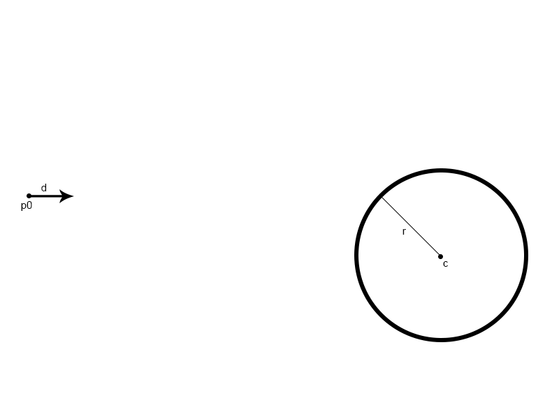

# Ray Against Sphere

Given the following image, we have :



* Ray __R__, defined by:
  * point __p0__
  * normal __d__
* Sphere __S__, defined by:
  * center point __c__ 
  * radius __r__

Given this information, we want to find out if ray __R__ intersects sphere __S__. If the ray intersects the sphere, it's going to be along the normal. In the image below, __t__ is the length at which the normal intersects the sphere:


An intersection happens at time __t__, along ray __R__. Another way to express this would be that the intersection happens at __R(t)__. To find __t__, we need to first find  __a__ and __f__. The formula for __t__ is:

```
t = a - f
```

In order to find __a__ and __f__, we need one more vector, vector __e__. Vector __e__ i the vector from __p0__ to __c__.

## The Algorithm

```cs
code
```

## On Your Own

Add the following function to the ```Collisions``` class:

```cs
code
```

And provide an implementation for it!

### Unit Test

You can [Download](../Samples/Raycast.rar) the samples for this chapter to see if your result looks like the unit test.

description of unit test


```cs
code
```