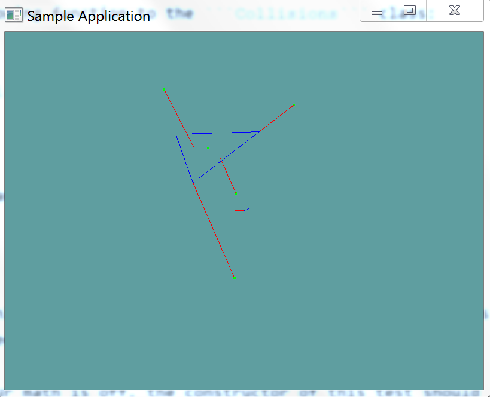

# Closest point to Triangle

Now that we can test if a point is inside a triangle or not, finding the closest point to a triangle becomes relativley simple. The process is as follows:

* Make a new plane out of the triangle
* Get the closest point on the test plane to your test point
  * This is your new test point 
* Is the point inside the triangle?
  * If so, that point is the closest point
* Convert each edge of the triangle to a line
* Get the closest point on line
* Check the distance between the test point and all 3 closest points
* Return the point with the shortest distance.  

Given that a triangle already consists of 3 points ABC (p0, p1 and p2), getting the 3 lines of AB, BC and CA becomes very simple. Especially when you consider that the line constructor takes two points.

Checking which point is closest is easy too, consider the following:

```cs
Point GetClosest(Point test, Point test1, Point test2, Point test2) {
  // Get 3 vectors, going from the test point to all potential candidates
  Vector3 diff1 = test - test1; // Vector from test point to potentially closest 1
  Vector3 diff2 = test - test2; // Vector from test point to potentially closest 2
  Vector3 diff3 = test - test3; // Vector from test point to potentially closest 3
  
  // Find out how far away each point is using the difference
  // vectors computed above
  float distSq1 = diff1.LengthSq();  
  float distSq2 = diff2.LengthSq();
  float distSq3 = diff3.LengthSq();
  
  // Find the shortest one
  float min = Min(distSq1, distSq2);
  min = Min(max, distSq3);
  
  // Finally, return the result
  if (min == distSq1) {
    return test1;
  }
  else if (min == distSq2) {
    return test2;
  }
  return test3;
}
```

## The Algorithm

Make sure you return a new point object, not a reference to the old point!

```cs
public static Point ClosestPoint(Triangle triangle, Point point) {
    Plane plane = new Plane(triangle.p0, triangle.p1, triangle.p2);
    point = ClosestPoint(plane, point);

    if (PointInTriangle(triangle, point)) {
        return new Point(point);
    }

    Line AB = new Line(triangle.p0, triangle.p1);
    Line BC = new Line(triangle.p1, triangle.p2);
    Line CA = new Line(triangle.p2, triangle.p0);

    Point c1 = ClosestPoint(AB, point);
    Point c2 = ClosestPoint(BC, point);
    Point c3 = ClosestPoint(CA, point);

    float mag1 = (point.ToVector() - c1.ToVector()).LengthSquared();
    float mag2 = (point.ToVector() - c2.ToVector()).LengthSquared();
    float mag3 = (point.ToVector() - c3.ToVector()).LengthSquared();

    float min = Math.Min(mag1, mag2);
    min = Math.Min(min, mag3);

    if (min == mag1) {
        return c1;
    }
    else if (min == mag2) {
        return c2;
    }
    return c3;
}
```

## On Your Own

Add the following function to the ```Collisions``` class:

```cs
public static Point ClosestPoint(Triangle triangle, Point point)
```

And provide an implementation for it!

### Unit Test

You can [Download](../Samples/3DModels.rar) the samples for this chapter to see if your result looks like the unit test.

If any of your math is off, the constructor of this test should throw errors. You should read trough the test, take note how i had to use an epsilon compare to compare two points.



```cs
using OpenTK.Graphics.OpenGL;
using Math_Implementation;
using CollisionDetectionSelector.Primitives;

namespace CollisionDetectionSelector.Samples {
    class ClosestPointTriangle : Application {
        protected Point[] points = new Point[] {
            new Point(1f, 1f, 1f), 
            new Point(-1f, -3f, -4f),
            new Point(2, 4, -1),
            new Point(-2.732051f, 6.732051f, 1.732051f),
            new Point(3, 7, -4)
        };
        Point[] tests = new Point[] {
            new Point(1, 3.5f, -1.5f),
            new Point(2, 2, -3),
            new Point(2, 4, -1),
            new Point(-1, 5, 0),
            new Point(3, 4, -0.9999995f),
        };

        Triangle triangle = new Triangle(new Point(-1.0f, 5.0f, 0.0f), new Point(2.0f, 2.0f, -3.0f), new Point(5.0f, 5.0f, 0.0f));

        public override void Intialize(int width, int height) {
            GL.Enable(EnableCap.DepthTest);
            GL.PointSize(4f);
            GL.Disable(EnableCap.CullFace);
            GL.PolygonMode(MaterialFace.FrontAndBack, PolygonMode.Line);

            for (int i = 0; i < points.Length; ++i) {
                Point c = Collisions.ClosestPoint(triangle, points[i]);
                if (!PointCompare(c, tests[i])) {
                    LogError("Expected point " + i + " to be: " + tests[i] + ", got: " + c);
                }
            }
        }

        protected bool PointCompare(Point p1, Point p2) {
            float epsilon = 0.00001f;

            float x = System.Math.Abs(p1.X - p2.X);
            float y = System.Math.Abs(p1.Y - p2.Y);
            float z = System.Math.Abs(p1.Z - p2.Z);

            if (x > epsilon) return false;
            if (y > epsilon) return false;
            if (z > epsilon) return false;
            return true;
        }

        public override void Render() {
            base.Render();
            DrawOrigin();

            GL.Color3(0.0f, 0.0f, 1.0f);
            triangle.Render();

            GL.Color3(1.0f, 0.0f, 0.0f);
            GL.Begin(PrimitiveType.Lines);
            for (int i = 0; i < points.Length; ++i) {
                Point closest = Collisions.ClosestPoint(triangle, points[i]);
                GL.Vertex3(points[i].X, points[i].Y, points[i].Z);
                GL.Vertex3(closest.X, closest.Y, closest.Z);
            }
            GL.End();

            GL.Color3(0.0f, 1.0f, 0.0f);
            foreach (Point point in points) {
                point.Render();
            }
        }
    }
}
```