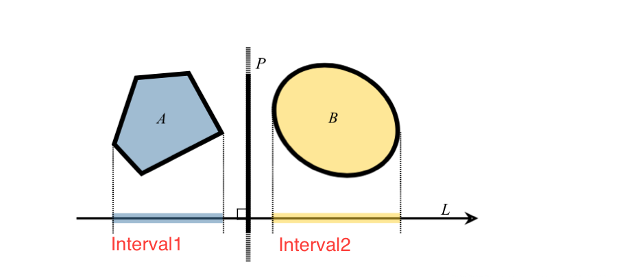

#Generic SAT Test

I originally wanted to leave this section until the end of the book, but triangle-triangle uses the most generic form of an SAT test, so this is a good place.

Triangle AABB used an optimized version of the SAT, that was optimized for those primitives. But, there is a way to generalize the SAT test so that it will work with ANY primitive! See [This presentation](../Sources/GDC08_Ericson_Physics_Tutorial_SAT.ppt) for details.

By now you should know what the SAT test does, so i'm going to skip the details of how a SAT test works.

## Getting the interval

Projecting any arbitrary shape onto a plane results in a line segment on that plane. This line segment is what we call the interval.  



```cs
class Interval {
    float min;
    float max;
}
```

We don't actually need to store an X / Y coordinate for the edges of the intervals. Because both intervals are on the same line, we just have to store the time t at which the interval starts and stops on the line.

It's possible to get the interval of any mesh (or primitive shape) if you know it's vertices. Getting an interval involves projecting each vector onto the given axis and storing the minimum and maximum values.  The following code will do that.

```cs
Interval GetInterval(BasicShape shape, Axis axis) {
    // This assumes that the axis is normalized!
    
    Interval result = new Interval();
    result.min = Dot(axis, shape.GetVertex(0));
    result.max = result.min;
    
    for (int i = 1; i < shape.VertexCount(); ++i) {
      float value = Dot(axis, shape.GetVertex(i));
      result.min = Min(result.min, value);
      result.max = Max(result.max, value);
    }
    
    return result;
}
```

## Comparing Intervals

Two objects intersect if there is no seperating axis between them. We have to test each axis. To test an axis you get the interval of the object on both axis, and check for overlap.

Once you have a way to get the interval of an object, you can perform an axis test like so:

```css
bool TestAxis(BasicShape shape1, BasicShape shape2, Vector3 axis) {
    // This assumes that axis s normalized!
    Interval i1 = GetInterval(shape1, axis);
    Interval i2 = GetInterval(shape2, axis);
    
    if (i1.max < i2.min || i2.max < i1.min) {
        // The intervals overlap on the given axis
        return true;
    }
    
    return false; // No collision found!
}
```

## Test Axis

We now know how to get the interval of any arbitrary shape. But how do we know what axis to