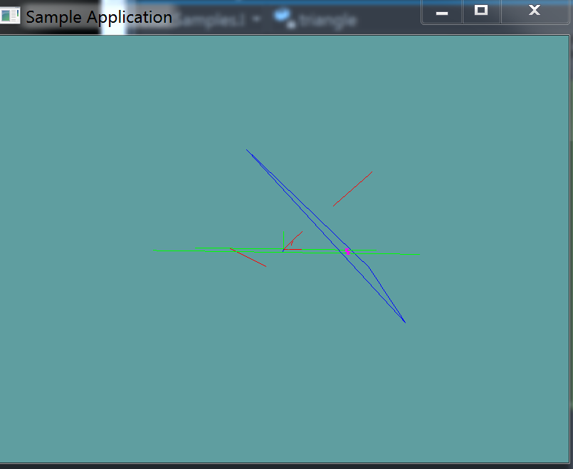

# Line Testing

Line testing is just a specialized form of ray casting. This test is done the same way all the other line tests are done, i'm not going to provide too much information on it.

## On Your Own

Implement the following function

```cs
public static bool LineTest(Line line, Triangle triangle, out Point result) {
```

It's just like all theother line test functions, i'm not going to go over it in detail.

### Unit Test

You can [Download](../Samples/3DModels.rar) the samples for this chapter to see if your result looks like the unit test.

A trianlge and a few lines are rendered. Any line intersecting the triangle is red. All rays not intersecting the triangle are blue. Green dots are rendered at the points of intersection. The constructor of this unit test will spit out errors if it finds any 



```cs
using OpenTK.Graphics.OpenGL;
using Math_Implementation;
using CollisionDetectionSelector.Primitives;

namespace CollisionDetectionSelector.Samples {
    class LinetestTriangle : Application {
        public Line[] lines = new Line[] {
            new Line(new Point(2.5f, 2.5f, 2.5f), new Point(4, 4, 4)),
            new Line(new Point(1f, 1f, 0f), new Point(0f, 0f, 0f)),
            new Line(new Point(-1f, -1f, 0f), new Point(-3f, 0f, 0f)),
            new Line(new Point(-5f, 0f, 0f), new Point(5f, 0f, 0f)),
            new Line(new Point(7f, 0f, 1f), new Point(-7f, 0f, 1f)),
            new Line(new Point(0.5f, 0.5f, 0.5f), new Point(0.5f, 0.5f, 2f))
        };
        Triangle triangle = new Triangle(new Point(5.207108f, -1.792894f, -3.949748f),
                                        new Point(5.207108f, -1.792894f, 5.949748f),
                                        new Point(-1.792894f, 5.207108f, 1));


        public override void Intialize(int width, int height) {
            GL.Enable(EnableCap.DepthTest);
            GL.PointSize(5f);
            GL.PolygonMode(MaterialFace.FrontAndBack, PolygonMode.Line);

            bool[] results = new bool[] { false, false, false, true, true, false };
            Point result = new Point();
            for (int i = 0; i < results.Length; ++i) {
                if (Collisions.LineTest(lines[i], triangle, out result) != results[i]) {
                    LogError("Line at index " + i + " was " +
                        (results[i] ? "expected" : "not expected") +
                        "to intersect the test triangle");
                }
            }
        }

        public override void Render() {
            base.Render();
            DrawOrigin();

            Point result = new Point();
            foreach (Line line in lines) {
                if (Collisions.LineTest(line, triangle, out result)) {
                    GL.Color3(1f, 0f, 1f);
                    result.Render();
                    GL.Color3(0f, 2f, 0f);
                }
                else {
                    GL.Color3(1f, 0f, 0f);
                }
                line.Render();
            }

            GL.Color3(0f, 0f, 1f);
            triangle.Render();
        }

        private void Log(string s) {
            System.Console.WriteLine(s);
        }
    }
}
```