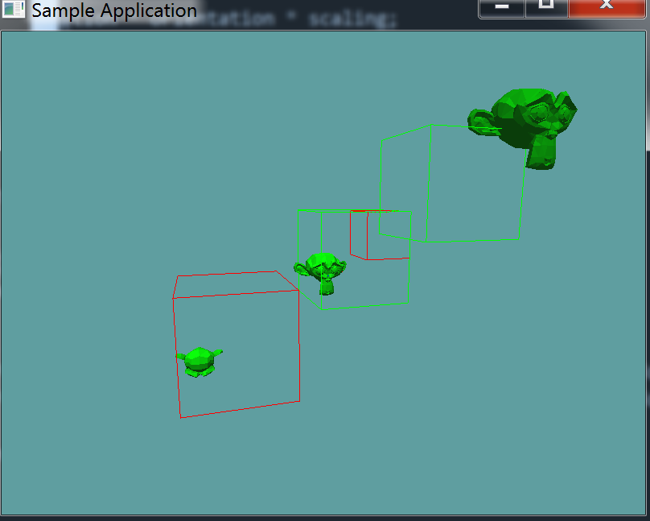

# Model AABB Intersection

We take a similar approach to the model AABB collision that we took to the model sphere collision. First, you find the inverse world matrix of the model. Next, construct a new AABB that is translated by this inverse matrix. Then do the collision waterfall:

* If the new AABB does not collide with the model's bounding box, there is no collision
* If the new AABB does not collide with the models bounding sphere, there is no collision
* If the new AABB collides with one of the models triangles, there is a collision
* By default, there is no collision

## On Your Own

Add the following function to the ```Collisions``` class:

```cs
// Conveniance function
public static bool Intersects(OBJ model, AABB aabb) {
    return Intersects(aabb, model);
}

public static bool Intersects(AABB aabb, OBJ model) {
    // TODO: Provide an implementation for this
}
```

And provide an implementation for it!

### Unit Test

You can [Download](../Samples/3DModels.rar) the samples for this chapter to see if your result looks like the unit test.

This unit test is visual only, make sure your project looks like the screenshot. Pay special attention to the aabb colors, green means there was a collision, red means there was not!



There is an error in the above image, the bottom left box is supposed to be red. IF yours is not, check your aabb, you probably need to call the ```Fix``` function. Despite it being visually correct, there is still a precision error.

Once you rotate an AABB, like we do in the collision test, it is no longer axis aligned. It becomes an oriented bounding box, or OBB. The fix for this bug is simple, instead of creating a new AABB that gets modified by the inverse world matrix, we need to create a new OBB.

The only issue is, we have not covered the implementation of an OBB yet, so for now, we are going to skip this and live with the error. OBB's will be covered in a future chapter.

```cs
using OpenTK.Graphics.OpenGL;
using Math_Implementation;
using CollisionDetectionSelector.Primitives;
using CollisionDetectionSelector;

namespace CollisionDetectionSelector.Samples {
    class OBJAABBIntersection : Application {
        OBJLoader loader = null;
        OBJ[] objs = new OBJ[] { null, null, null };

        AABB[] tests = new AABB[] {
            new AABB(new Point(2f, 2f, 2f), new Point(6f, 6f, 6f)),
            new AABB(new Point(-1f, -1f, -1f), new Point(-7f, -7f, -7f)),
            new AABB(new Point(-1f, -1f, -1f), new Point(3f, 3f, 3f)),
            new AABB(new Point(1f, 1f, 1f), new Point(3f,3f, 3f)),
        };

        public override void Intialize(int width, int height) {
            GL.Enable(EnableCap.DepthTest);
            GL.Enable(EnableCap.CullFace);
            GL.Enable(EnableCap.Lighting);
            GL.Enable(EnableCap.Light0);

            GL.Light(LightName.Light0, LightParameter.Position, new float[] { 0.0f, 0.5f, 0.5f, 0.0f });
            GL.Light(LightName.Light0, LightParameter.Ambient, new float[] { 0f, 1f, 0f, 1f });
            GL.Light(LightName.Light0, LightParameter.Diffuse, new float[] { 0f, 1f, 0f, 1f });
            GL.Light(LightName.Light0, LightParameter.Specular, new float[] { 1f, 1f, 1f, 1f });

            loader = new OBJLoader("Assets/suzanne.obj");
            objs[0] = new OBJ(loader);
            objs[1] = new OBJ(loader);
            objs[2] = new OBJ(loader);

            objs[1].Position = new Vector3(6.0f, 6.0f, 6.0f);
            objs[1].Scale = new Vector3(1.5f, 1.5f, 1.5f);

            objs[2].Position = new Vector3(-6.0f, -6.0f, -6.0f);
            objs[1].Scale = new Vector3(1.5f, 1.5f, 1.5f);
            objs[2].Rotation = new Vector3(90.0f, 0.0f, 0.0f);
        }

        public override void Render() {
            GL.Disable(EnableCap.Lighting);
            base.Render();
            DrawOrigin();
            GL.Enable(EnableCap.Lighting);

            GL.Color3(0f, 0f, 1f);
            foreach (OBJ obj in objs) {
                obj.Render();
            }

            GL.PolygonMode(MaterialFace.FrontAndBack, PolygonMode.Line);
            GL.Disable(EnableCap.Lighting);
            foreach (AABB test in tests) {
                bool intersection = false;
                foreach (OBJ obj in objs) {
                    if (Collisions.Intersects(test, obj)) {
                        intersection = true;
                    }
                }
                if (intersection) {
                    GL.Color3(0f, 1f, 0f);
                }
                else {
                    GL.Color3(1f, 0f, 0f);
                }
                test.Render();
            }
            GL.Enable(EnableCap.Lighting);
            GL.PolygonMode(MaterialFace.FrontAndBack, PolygonMode.Fill);
        }
    }
}
```