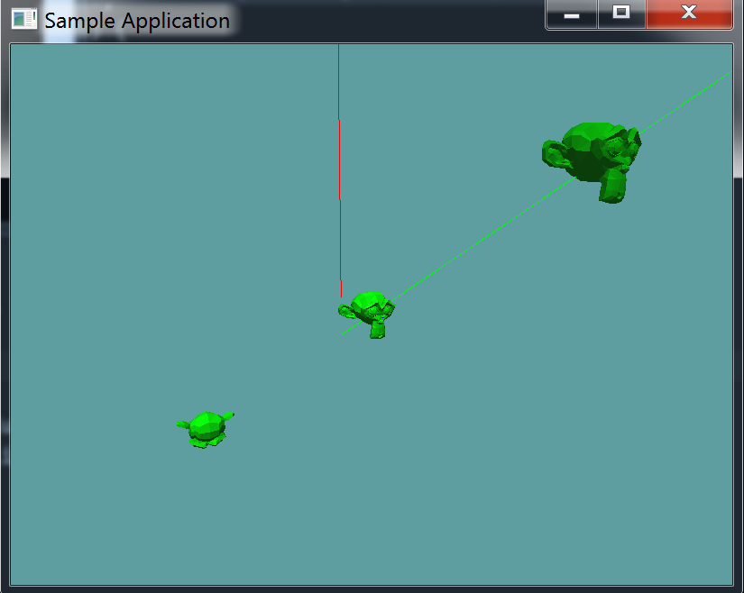

# Model Raycast

To raycast against a model is similar to what we've been doing so far. Make a new ray by multiplying the position of the ray (MultiplyPoint) and the normal of the ray (MultiplyVector)  by the inverse matrix. Then, use this new ray to raycast against the models bounding sphere, bounding box and finally all it's triangles. 

When you call the raycast against the models bounding sphere or box, pass the argument t that this method recieves as the out argument. Example:

```cs
public static bool Raycast(Ray ray, OBJ model, out float t) {
    // Code to create newRay
    if (!Raycast(newRay, model.BoundingSphere, out t)) {
        return false;
    }
    // rest of function
}
```

## On Your Own

Add the following function to the ```Collisions``` class:

```cs
public static bool Raycast(Ray ray, OBJ model, out float t)
```

And provide an implementation for it!

### Unit Test

You can [Download](../Samples/3DModels.rar) the samples for this chapter to see if your result looks like the unit test.

This unit test is visual only, make sure your project looks like the screenshot. Pay special attention to the ray colors, green means there was a collision, red means there was not!



```cs
using OpenTK.Graphics.OpenGL;
using Math_Implementation;
using CollisionDetectionSelector.Primitives;
using CollisionDetectionSelector;

namespace CollisionDetectionSelector.Samples {
    class OBJRaycast : Application {
        OBJLoader loader = null;
        OBJ[] objs = new OBJ[] { null, null, null };

        Ray[] tests = new Ray[] {
            new Ray(new Point(-1f, -1f, -1f), new Vector3(1f, 1f, 1f)),
            new Ray(new Point(-2f, 1f, 1f), new Vector3(0f, 1f, 0f))
        };

        public override void Intialize(int width, int height) {
            GL.Enable(EnableCap.DepthTest);
            GL.Enable(EnableCap.CullFace);
            GL.Enable(EnableCap.Lighting);
            GL.Enable(EnableCap.Light0);

            GL.Light(LightName.Light0, LightParameter.Position, new float[] { 0.0f, 0.5f, 0.5f, 0.0f });
            GL.Light(LightName.Light0, LightParameter.Ambient, new float[] { 0f, 1f, 0f, 1f });
            GL.Light(LightName.Light0, LightParameter.Diffuse, new float[] { 0f, 1f, 0f, 1f });
            GL.Light(LightName.Light0, LightParameter.Specular, new float[] { 1f, 1f, 1f, 1f });

            loader = new OBJLoader("Assets/suzanne.obj");
            objs[0] = new OBJ(loader);
            objs[1] = new OBJ(loader);
            objs[2] = new OBJ(loader);

            objs[1].Position = new Vector3(6.0f, 6.0f, 6.0f);
            objs[1].Scale = new Vector3(1.5f, 1.5f, 1.5f);

            objs[2].Position = new Vector3(-6.0f, -6.0f, -6.0f);
            objs[1].Scale = new Vector3(1.5f, 1.5f, 1.5f);
            objs[2].Rotation = new Vector3(90.0f, 0.0f, 0.0f);
        }

        public override void Render() {
            GL.Disable(EnableCap.Lighting);
            base.Render();
            DrawOrigin();
            GL.Enable(EnableCap.Lighting);

            GL.Color3(0f, 0f, 1f);
            foreach (OBJ obj in objs) {
                obj.Render();
            }

            GL.Disable(EnableCap.Lighting);
            GL.Disable(EnableCap.CullFace);
            float t = 0;
            foreach (Ray test in tests) {
                bool intersection = false;
                foreach (OBJ obj in objs) {
                    if (Collisions.Raycast(test, obj, out t)) {
                        intersection = true;
                    }
                }
                if (intersection) {
                    GL.Color3(0f, 1f, 0f);
                }
                else {
                    GL.Color3(1f, 0f, 0f);
                }
                test.Render();
            }
            GL.Enable(EnableCap.CullFace);
            GL.Enable(EnableCap.Lighting);
        }
    }
}
```