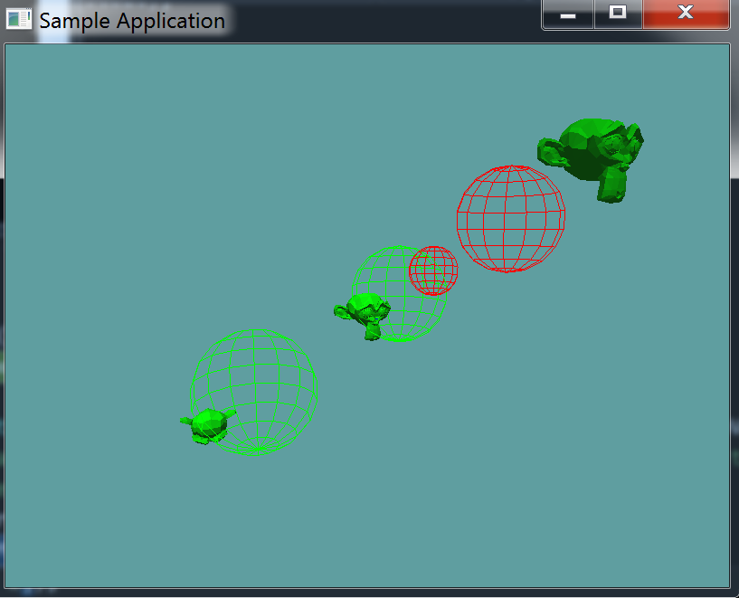

#Model Sphere Collision

The actual testing of collisions gets a bit complicated, the sphere is the perfect primitive to explore this with. 

The first ting to know is that the model is in world-space, but it's collision primitives are in model space. That is, to test the AABB of the OBJ against a sphere accuratley, we must move the AABB into world space. We could do this by multiplying the min and max of the AABB by the ```worldMatrix``` of the OBJ.

The above solution is bad for a number of reasons. first, because all of the OBJ's share one ```OBJLoader```, where would such a transformed AABB live? In the OBJ, or the OBJLoader? Sure you could make the getter of OBJ do the work, but that might get messy.

Second, and more importantly, this method would only be viable for broad-phase primitives. Once you get to narrow-phase collision, multiplying each triangle by the worldMatrix becomes implausable.

A much better solution is to leave the model at the origin of the world, and move the primtiive being tested (in this case the sphere) such that relative to it, the model is at origin. 

We can achieve this by multiplying the position of the sphere by the inverse of the model's world matrix. This works, because if we where to multiply the models' workld position by the inverse of it's work matrix too, it would be at the origin of the world. In theory we translate both objects the same.

## The test

The test is simple, use the inverse world matrix of the model to create a new sphere whos center is translated. Then, do broad phase testing, if neither bounding sphere, nor bounding box intersect no intersection can happen. Finally, loop trough all the triangles, if one of them intersects and intersection did happen. If none of them do, no intersection happened.

I'm providing all the code needed for this one, there is no todo. Add the following test to ```Collisions.cs```

```cs
// Conveniance method
public static bool Intersects(OBJ model, Sphere sphere) {
    return Intersects(sphere, model);
}
    
public static bool Intersects(Sphere sphere, OBJ model) {
    Matrix4 inverseWorldMatrix = Matrix4.Inverse(model.WorldMatrix);

    Vector3 newSpherePos = Matrix4.MultiplyPoint(inverseWorldMatrix, sphere.Position.ToVector());
    // We have to scale the radius of the sphere! This is difficult. The new scalar is the old radius
    // multiplied by the largest scale component of the matrix
    float newSphereRad = sphere.Radius * Math.Max(
        Math.Max(inverseWorldMatrix[0, 0], inverseWorldMatrix[1, 1]),
        inverseWorldMatrix[2, 2]);
    
    // We make this new sphere because the old one is passed in
    // by reference. We don't want to actually modify
    // the reference!
    Sphere translatedSphere = new Sphere(newSpherePos, newSphereRad);

    // Broad-phase
    // If the bounding sphere does not intersect, nothing will
    if (!Intersects(model.BoundingSphere, translatedSphere)) {
        return false;
    }

    // Broad-phase
    // If the bounding box does not intersect, nothing will
    if (!Intersects(model.BoundingBox, translatedSphere)) {
        return false;
    }

    // Narrow-phase
    // At least one triangle must intersect!
    for(int i = 0, len = model.Mesh.Length; i < len; ++i) {
        if (Intersects(model.Mesh[i], translatedSphere)) {
            return true;
        }
    }

    // Narrow-phase
    // None of the triangles intersected, no intersection
    return false;
}
```

## Unit Test

You can [Download](../Samples/3DModels.rar) the samples for this chapter to see if your result looks like the unit test.

This unit test is visual only, make sure your project looks like the screenshot. Pay special attention to the sphere colors, green means there was a collision, red means there was not!



```cs
using OpenTK.Graphics.OpenGL;
using Math_Implementation;
using CollisionDetectionSelector.Primitives;
using CollisionDetectionSelector;

namespace CollisionDetectionSelector.Samples {
    class OBJSphereIntersection : Application {
        OBJLoader loader = null;
        OBJ[] objs = new OBJ[] { null, null, null };

        Sphere[] tests = new Sphere[] {
            new Sphere(4f, 4f, 4f, 2f),
            new Sphere(-4f, -4f, -4f,3f),
            new Sphere(1f, 1f, 1f, 2f),
            new Sphere(2f, 2f, 2f, 1f),
        };

        public override void Intialize(int width, int height) {
            GL.Enable(EnableCap.DepthTest);
            GL.Enable(EnableCap.CullFace);
            GL.Enable(EnableCap.Lighting);
            GL.Enable(EnableCap.Light0);

            GL.Light(LightName.Light0, LightParameter.Position, new float[] { 0.0f, 0.5f, 0.5f, 0.0f });
            GL.Light(LightName.Light0, LightParameter.Ambient, new float[] { 0f, 1f, 0f, 1f });
            GL.Light(LightName.Light0, LightParameter.Diffuse, new float[] { 0f, 1f, 0f, 1f });
            GL.Light(LightName.Light0, LightParameter.Specular, new float[] { 1f, 1f, 1f, 1f });

            loader = new OBJLoader("Assets/suzanne.obj");
            objs[0] = new OBJ(loader);
            objs[1] = new OBJ(loader);
            objs[2] = new OBJ(loader);

            objs[1].Position = new Vector3(6.0f, 6.0f, 6.0f);
            objs[1].Scale = new Vector3(1.5f, 1.5f, 1.5f);

            objs[2].Position = new Vector3(-6.0f, -6.0f, -6.0f);
            objs[1].Scale = new Vector3(1.5f, 1.5f, 1.5f);
            objs[2].Rotation = new Vector3(90.0f, 0.0f, 0.0f);
        }

        public override void Render() {
            GL.Disable(EnableCap.Lighting);
            base.Render();
            DrawOrigin();
            GL.Enable(EnableCap.Lighting);

            GL.Color3(0f, 0f, 1f);
            foreach (OBJ obj in objs) {
                obj.Render();
            }

            GL.PolygonMode(MaterialFace.FrontAndBack, PolygonMode.Line);
            GL.Disable(EnableCap.Lighting);
            foreach (Sphere test in tests) {
                bool intersection = false;
                foreach (OBJ obj in objs) {
                    if (Collisions.Intersects(test, obj)) {
                        intersection = true;
                    }
                }
                if (intersection) {
                    GL.Color3(0f, 1f, 0f);
                }
                else {
                    GL.Color3(1f, 0f, 0f);
                }
                test.Render();
            }
            GL.Enable(EnableCap.Lighting);
            GL.PolygonMode(MaterialFace.FrontAndBack, PolygonMode.Fill);
        }
    }
}
```