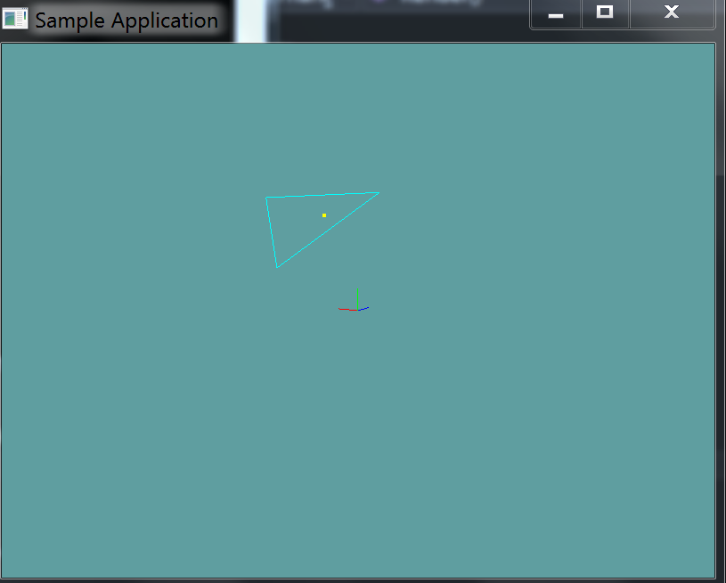
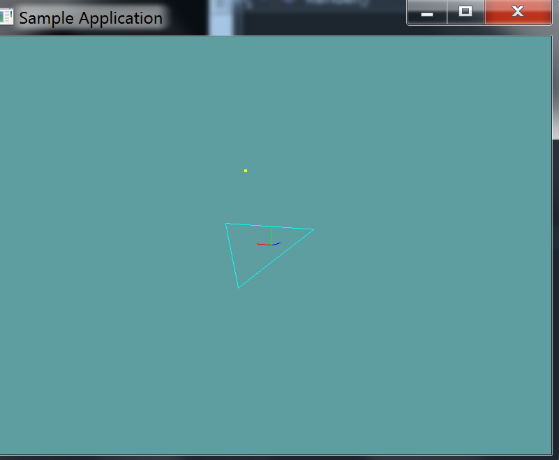
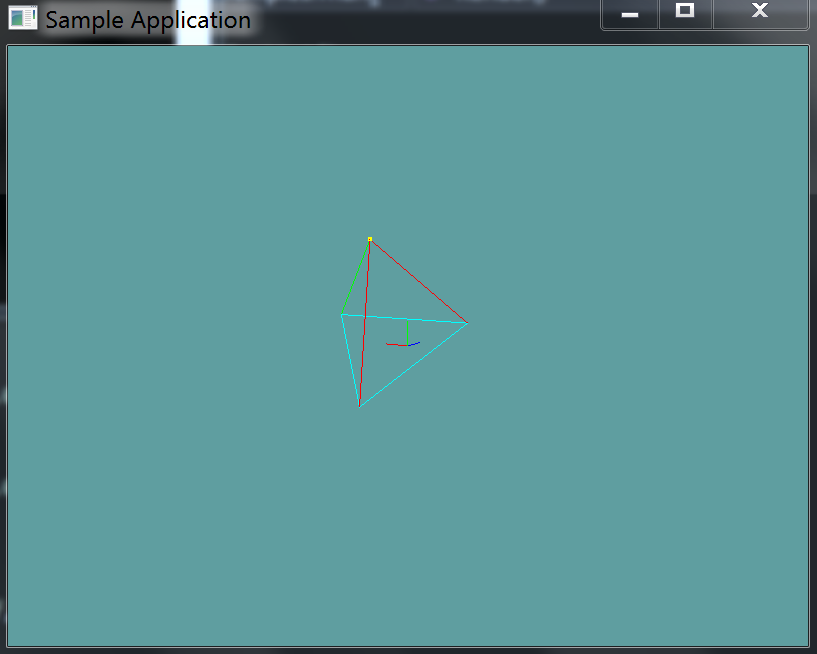
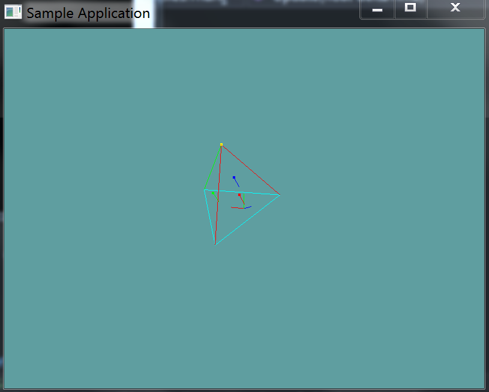

#Point in Triangle

The easyest way to test if a point is in a triangle is commonly refered to as the [Same Side](http://www.blackpawn.com/texts/pointinpoly/) technique. I suggest reading that article, only the Same Side portion, not the barycentric one. The only problem is, the method presented is a 2D method. In addition to the 3 side tests you must also check if the test point is on the plane formed by the triangle.

Given the above paragraph and the extra condition i gave you you could build a 3D point in triangle test, but it would be an expensive one. Instead, we can do the test much cheaper.

### A cheaper test

There is another intersection test we can perform, this one is easyer to read but harder to visualize. 

Given a triangle ABC and point P, we translate triangle ABC in a way that P lies on it's origin. The test now becomes checking if world origin is contained in the translated triangle (Still refered to as ABC).

P lies in the triangle ABC only if PAB, PBC and PCA are all clockwise, or counterclockwise. Because P is at the origin, this is now just a matter of checking cross products.

* Move the triangle so that the point becomes the triangle's origin space
* Create 3 new triangles between the triangle and the point (Making a pyramid)
* Check to see if all sides of the pyramid point in the same direction (Relative to world origin)

Let's see an example, we have a triangle and a point:

First, we translate the triangle so that the test point is it's origin:

Next we construct triangles PAB, PBC and PCA (You can only see the red and green ones, the blue one shares the same lines so it's not visible)

Now we check the normals of these 3 triangles

Because all of the normals are facing the same way, the triangles are wound the same. Because of this, the point is inside the triangle!

This is what the same steps look like when the point is not in a triangle:

