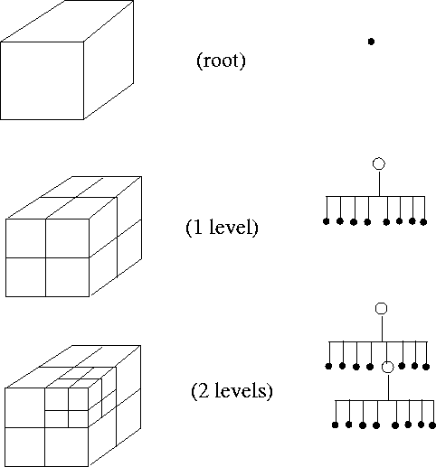
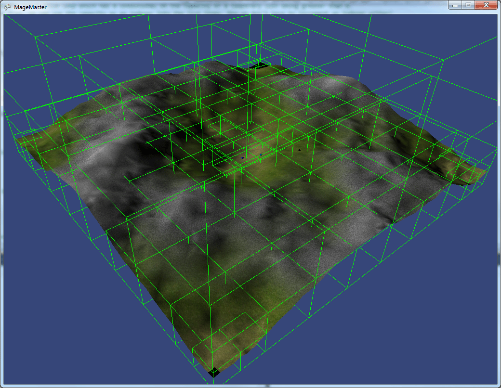

TODO: Review [This](https://www.youtube.com/watch?v=TwZH-aoSzJk)

#Raycast Model

Raycasting against an OBJ model is a VERY common operation. So common in fact, that the primitive implementation we have created so far is too slow.

One of the best examples of this is clamping a character to the world. The world (terrain) is usually represented as an OBJ mesh. Characters run around on top of this mesh. To clamp the character to the mesh we often use a raycast. 

That is, we raycast from above the character down onto the terrain, wherever the raycast hits is where we clamp the character to. Having a terrain with say 6,000 triangles and a player character is no problem. Looping trough 6k triangles and doing a raycast against each of them once is acceptable. But when you have NPC's involved, looping trough the same ammount of characters 20 times slows the game to a crawl!

We can fix this problem by adding a new acceleration structure to the OBJ class, similar to the BoundingSphere and BoundingBox. This new acceleration structure is known as a bounding volume hierarchy, or BVH for short. (Side note, BVH is also the extension of an animation format, making googling the topic a little difficult)

### Bounding Volume Hierarchy 

The idea of a BVH is simple, it's a tree of AABB's. We take the top level bounding box, and divide it into 4 smaller bounding boxes. We keep doing this until the tree is at a certain depth (Say 12). Now we have a highly subdivided model.

We loop trough each leaf node and check for collision against the triangles of the model. Whatever triangle collides with the leaf node is added to a list of triangles inside the leaf node. 

Now we have an AABB tree with a bunch of triangles in each leaf node. When you do a raycast you start at the top of the tree, if the ray intersects this AABB, then you check all 4 of it's childern. Whichever child the ray intersects, you check it's children. It's a recursive process until your ray hits a leaf node. Once your ray hit a leaf node, you check for collision with the triangles inside that leaf node.

Essentially, you just traded checking 6k triangles / raycast for checking maybe 20 AABB's and 30 Triangles. You can see how this will speed up raycasting against a mesh tremendusly!

Here is an example of a BVH around a multi million triangle bunny model. This BVH is optimized in a manner that when an AABB does not contain any triangles, it is not split into child nodes. Therefore, this tree has leaf nodes with no triangles.

It might not be obvious in the above image, but this is how the ocrree is constructed trough sub-division:

And this is what your average mehs terrain looks like with the BVH acceleration structure rendering around it.

###Optimize ALL OF IT