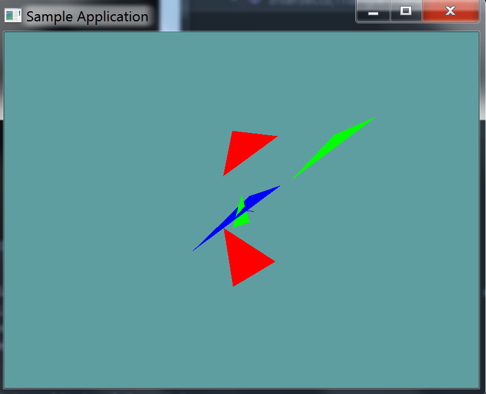

# Triangle Triangle

As mentioned above, the triangle-triangle test is a generic form SAT test. As such

## On Your Own

Add the following private static function to your collision class, it's going to be a helper function to get the interval of the triangle. You can return the interval however you like (Make a new class, use a vector 2, use out variables), whatever makes sense to you. I did mine with a Vector2.

```cs
Vector2 GetInterval(Triangle triangle, Vector3 axis) {
    // Vector2.X = min
    // Vector2.Y = max.
}
```

Next, we need to add another private static helper function, to test two triangles on an actual axis

```cs
bool TestAxis(Triangle triangle1, Triangle triangle2, Vector3 axis) {
    // TODO: Test the intervals for overlap
}
```

Finally, add the public static function that tests 2 triangles for intersections, and provide an implementation for it!

You will need to test 11 axis, the face normal of triangle1, the face normal of triangle2, and the cross products of each of the 3 edges of the triangles. The previous section "Generic SAT" outlined how to get this information from a triangle.

```cs
public static bool Intersects(Triangle triangle1, Triangle triangle2) 
```

### Unit Test

You can [Download](../Samples/3DModels.rar) the samples for this chapter to see if your result looks like the unit test.

This unit test will check a few triangles against the blue one. Any triangle that intersects is green, ones that don't are red. The constructor does NOT throw any errors, this unit is visual only.

One thing you might notice is that one of the triangles gives us a false positive! This is becuase the SAT as we've implemented it is non-robust. Because both triangles are on the same plane, all of the cross products we do yield 0. And because they are all 0, they all intersect. We will fix this in the next section.



```cs
using OpenTK.Graphics.OpenGL;
using Math_Implementation;
using CollisionDetectionSelector.Primitives;

namespace CollisionDetectionSelector.Samples {
    class TriangleTriangleIntersection : Application {
        Triangle test = new Triangle(new Point(5, 6, 7), new Point(6, 5, 4), new Point(1, 2, 3));
        Triangle[] triangles = new Primitives.Triangle[] {
            new Triangle(new Point(-1.0f, 5.0f, 0.0f), new Point(2.0f, 2.0f, -3.0f), new Point(5.0f, 5.0f, 0.0f)),
            new Triangle(new Point(-1, -1, 0), new Point(0, 1, 0), new Point(1, -1, 0)),
            new Triangle(new Point(-1.0f, -5.0f, 0.0f), new Point(2.0f, -2.0f, -3.0f), new Point(5.0f, -5.0f, 0.0f)),
            new Triangle(new Point(5, 6, 7), new Point(6, 5, 4), new Point(1, 2, 3)),
        };

        public override void Intialize(int width, int height) {
            GL.Enable(EnableCap.DepthTest);
            GL.PointSize(4f);
            GL.Disable(EnableCap.CullFace);

            Vector3 center = test.p0.ToVector() + test.p1.ToVector() + test.p2.ToVector();
            center *= 1.0f / 3.0f;

            test.p0.X -= center.X;
            test.p0.Y -= center.Y;
            test.p0.Z -= center.Z;

            test.p1.X -= center.X;
            test.p1.Y -= center.Y;
            test.p1.Z -= center.Z;

            test.p2.X -= center.X;
            test.p2.Y -= center.Y;
            test.p2.Z -= center.Z;
        }

        public override void Render() {
            base.Render();
            DrawOrigin();

            GL.Color3(0.0f, 0.0f, 1.0f);
            test.Render();

            foreach (Triangle triangle in triangles) {
                if (Collisions.Intersects(triangle, test)) {
                    GL.Color3(0f, 1f, 0f);
                }
                else {
                    GL.Color3(1f, 0f, 0f);
                }
                triangle.Render();
            }
        }
    }
}
```