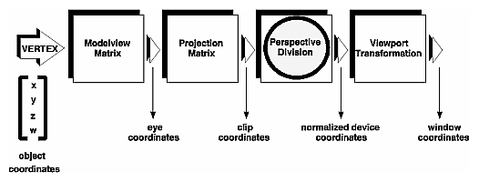

#Picking

Object picking is one of those problems that's fairly easy to solve, but for some reason no one ever knows how. What is picking? Click on a 3D scene, and the object you click on gets selected. So how to we accompolish this?

The user clicks on the screen. We find the pixel they selected on the near and far clip planes of the view frustum. We use these two points to construct a ray, then we do a raycast into the world using this ray. Whatever object collides with the ray (and has the lowest t value) is the object the user clicked on!


The entire point of the OpenGL graphics pipeline is to take a world-space point and transform it to screen space coordinates. This is done using a variety of matrix multiplications. For picking we have to do the reverse! We have to take a screen space point and apply the reverse of the graphics pipeline to get two world space points.

Going from world space to screen space (What openGL does) is called __Projection__. Going from screen space to world space (What we need to do) is __Un-Projection__. Let's take a look at the projection pipeline:



##Un-project

It's time to implement an "Unproject" function. I'm adding this to my __Matrix4.cs__ file, as it is a matrix function.

The unproject function takes 4 arguments. The first one is a ```Vector3``` that is the screen space position of the mouse. Of course, screen space mouse only has an 

```cs
public static Vector3 UnProject(Vector3 windowCoords, Matrix4 modelView, Matrix4 projection, float[] viewPort) {
    // First, convert from window coordinates to NDC coordinates
    Vector4 ndcCoords = new Vector4(windowCoords.X, windowCoords.Y, windowCoords.Z, 1.0f);
    ndcCoords.X = (ndcCoords.X - viewPort[0]) / viewPort[2]; // Range 0 to 1: (windowX - viewX) / viewWidth
    ndcCoords.Y = (ndcCoords.Y - viewPort[1]) / viewPort[3]; // Range 0 to 1: (windowY - viewY) / viewHeight
    // Remember, NDC ranges from -1 to 1, not 0 to 1
    ndcCoords.X = ndcCoords.X * 2f - 1f; // Range: -1 to 1
    ndcCoords.Y = 1f - ndcCoords.Y * 2f; // Range: -1 to 1 - Flipped!
    ndcCoords.Z = ndcCoords.Z * 2f - 1f; // Range: -1 to 1

    // Next, from NDC space to eye / view space.
    // We get here by multiplying the inverse of the projection matrix
    // by NDC coords. Note, this leaves a scalar in the W component!
    Vector4 eyeCoords = Matrix4.Inverse(projection) * ndcCoords;

    // Next, from eye space to world space.
    // Remember, eye space assumes the camera is at the center of the world,
    // this is not the case, let's move the actual point into world space
    Vector4 worldCoords = Matrix4.Inverse(modelView) * eyeCoords;

    // Finally, undo the perspective divide!
    // When we multiplied by the inverse of the projection matrix, that
    // multiplication left the inverse of the perspective divide in the 
    // W component of the resulting vector. This could be 0
    if (Math.Abs(0.0f - worldCoords.W) > 0.00001f) {
        // This is the same as dividing every component by W
        worldCoords *= 1.0f / worldCoords.W;
    }

    // Now we have a proper 4D vector with a W of 1 (or 0)
    return new Vector3(worldCoords.X, worldCoords.Y, worldCoords.Z);
}
```