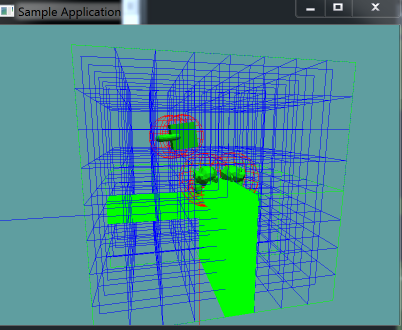

# Raycasting

This is where we see the acceleration power of the octree! Like with the BVH, we're going to re-direct raycasting against a scene to actually raycast against the octree. Also like BVH, this is the only intersection test we're going to accelerate. But do keep in mind, in a AAA engine, all intersections would happen trough the octree, not just raycasting.

## Implementation

Inside the ```OctreeNode``` class, we're going to implement a recursive raycast method. The implementation of this method is fairly straight forward.

First, we're going to take care of the recursive part. If the node has children, we loop trough all it's children. We check the ray against each of the AABB's of the child nodes. If the ray does not hit the bounds of the child node, it can't hit anything in the child. If the ray does intersect with the bounds of the child node, we recursivley call this same ```Raycast``` function on the child node.

The recursive part only applies to non-leaf nodes. After that, let's handle the leaf node scenario. If a node is a leaf node, we already know it passed the ray-bounds test, so we just loop trough all the OBJ contents of the node. If the ray hits any of the OBJ's contained within this node, we return said OBJ.

By default, return null!


```cs
public OBJ Raycast(Ray ray, out float t) {
    // This is NOT a leaf node, see which child can be raycast against!
    if (Children != null) {
        foreach(OctreeNode child in Children) {
            // Does the ray intersect the AABB of the node in question?
            if (Collisions.Raycast(ray, child.Bounds, out t)) {
                // If so, recursivley call the raycast method!
                OBJ result = child.Raycast(ray, out t);
                // If we hit something, return it!
                if (result != null) {
                    return result;
                }
            }
        }
    }
    // This IS a leaf node! See if any of the contents are hit by the ray.
    // If we made it this far, then the Bounds already intersect the ray,
    // no bounds check for the OctreeNode is needed!
    else if (Contents != null) {
        // Loop trough all children
        foreach(OBJ content in Contents) {
            // Return the first child that was hit!
            if (Collisions.Raycast(ray, content, out t)) {
                return content;
            }
        }
    }

    t = 0f;
    return null;
}
```

### Changing the scene

Now that we have a raycast method implemented in the ```OctreeNode``` class, we no longer need the implementation in the ```Scene``` class.

Go ahead and remove the ```RecursiveRaycast``` method from the ```Scene``` class. Change the two ```Raycast``` methods inside the ```Scene``` class, to just call the ```Raycast``` method of the octree, like so:


```cs
public OBJ Raycast(Ray ray, out float t) {
    //return RecursiveRaycast(RootObject, ray, out t);
    return Octree.Raycast(ray, out t);
}

public OBJ Raycast(Ray ray) {
    float t = 0.0f;
    //return RecursiveRaycast(RootObject, ray, out t);
    return Octree.Raycast(ray, out t);
}
```

This is actually how a scene works. It's a transform hierarchy and an octree. All of the methods inside the scene are just facads for the hierarchy and octree.

__Run__ the last example, and nothing has changed. We still have a blue (hit detected) and red (hit not detected) ray in the scene. But, the raycast code is now much faster! It no longer loops trough all possible objects in the scene, rather it iterates over a well orgonized tree. 

This might not make a huge performance difference right now, but when you get into the 10,000 object range it's really noticable!

### Get Fancy

Just for the sake of fancy-ness i want to modify the octree so we can visualize exactly which nodes get traversed!

First, add a new debug bool to ```OctreeNode``` to let us know if the node has been visited or not:

```cs
protected bool debugVisited = false;
```

Next, inside the ```Racyast``` function of ```OctreeNode``` flip the new debug flag to true

```cs
public OBJ Raycast(Ray ray, out float t) {
    debugVisited = true;

    // This is NOT a leaf node, see which child can be raycast against!
```

Then, modify the ```DebugRender``` function of the ```OCtreeNode``` class to render the visited nodes as green:

```cs
 public void DebugRender() {
    if (debugVisited) {
        GL.Color3(0f, 1f, 0f);
    }
    else {
        GL.Color3(0f, 0f, 1f);

    }
    Bounds.Render();

    if (Contents != null) {
```

Changing the outline will not be enough. It's going to flicker, because child AABB's are drawn where the parent AABB's are present. I want to get fancy and add a new debug render method that renders only the legit visited nodes:

```cs
public void DebugRenderOnlyVisitedNodes() {
    if (!debugVisited) {
        return;
    }
    if (Children != null) {
        foreach (OctreeNode node in Children) {
            node.DebugRenderOnlyVisitedNodes();
        }
    }
    else {
        GL.Color3(0f, 1f, 0f);
        Bounds.Render();
    }
}
```

Finally, let's modify the ```Render``` method of the ```Scene``` class to render the visited nodes as solid boxes:

```cs
public void Render() {
    RootObject.Render();
    GL.Disable(EnableCap.Lighting);
    GL.PolygonMode(MaterialFace.FrontAndBack, PolygonMode.Line);
    Octree.DebugRender();
    GL.PolygonMode(MaterialFace.FrontAndBack, PolygonMode.Fill);
    /* NEW */ Octree.DebugRenderOnlyVisitedNodes();
    GL.Enable(EnableCap.Lighting);
}
```

That's it! Running the last unit test should now look like this:



For this demo it might not make a big difference, but for a larger demo it would! Also, this is a very small Octree. Usually one octree node is large enough to contain 3 to 5 objects! The size of our entire octree is usually the size of a single node on a larger scale project.