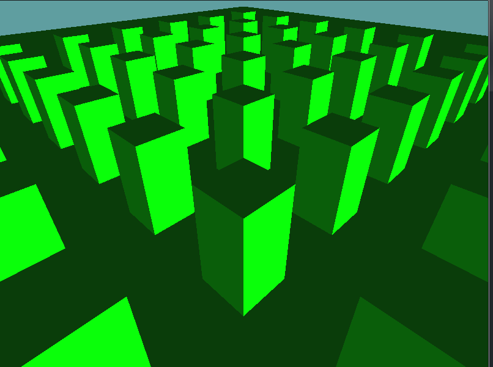
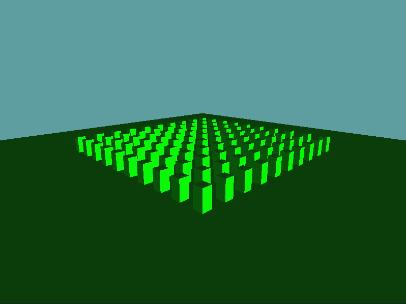

# Camera

So far, we've set the view matrix of every example scene manually. Now, it's time to implement a camera! We're going to implement a mouse controlled editor camera. Our controls are going to be:

* Left click + Drag - Move the camera around
* Right click + Drag - Rotate the camera around
* Mouse wheel - Zoom the camera in and out 

## Getting Ready

Let's set up a quick scene before we do anything

```cs
using OpenTK.Graphics.OpenGL;
using Math_Implementation;
using CollisionDetectionSelector.Primitives;
using CollisionDetectionSelector;

namespace CollisionDetectionSelector.Samples {
    class CameraSample : Application {
        Scene scene = new Scene();
        OBJLoader cube = null;

        void AddCubeToSceneRoot(Vector3 position, Vector3 scale) {
            scene.RootObject.Children.Add(new OBJ(cube));
            int count = scene.RootObject.Children.Count - 1;
            scene.RootObject.Children[count].Parent = scene.RootObject;
            scene.RootObject.Children[count].Position = position;
            scene.RootObject.Children[count].Scale = scale;
        }

        public override void Intialize(int width, int height) {
            GL.Enable(EnableCap.DepthTest);
            GL.Enable(EnableCap.Lighting);
            GL.Enable(EnableCap.Light0);
            GL.PointSize(5f);

            GL.Light(LightName.Light0, LightParameter.Position, new float[] { 0.5f, -0.5f, 0.5f, 0.0f });
            GL.Light(LightName.Light0, LightParameter.Ambient, new float[] { 0f, 1f, 0f, 1f });
            GL.Light(LightName.Light0, LightParameter.Diffuse, new float[] { 0f, 1f, 0f, 1f });
            GL.Light(LightName.Light0, LightParameter.Specular, new float[] { 1f, 1f, 1f, 1f });

            scene.Initialize(7f);
            cube = new OBJLoader("Assets/cube.obj");

            AddCubeToSceneRoot(new Vector3(0.0f, 0.0f, 0.0f), new Vector3(50.0f, 1.0f, 50.0f));
            for (int i = 0; i < 10; ++i) {
                for (int j = 0; j < 10; ++j) {
                    AddCubeToSceneRoot(new Vector3(25 - i * 5, 0.0f, 25 - j * 5), new Vector3(1.0f, 5.0f, 1.0f));
                }
            }
        }

        public override void Render() {
            Matrix4 viewMat = Matrix4.LookAt(new Vector3(10, 10, 10), new Vector3(0, 0, 0), new Vector3(0, 1, 0));
            GL.LoadMatrix(viewMat.OpenGL);
            DrawOrigin();

            GL.Enable(EnableCap.Lighting);
            scene.Render(false);
            GL.Disable(EnableCap.Lighting);
        }
    }
}
```

This is a simple scene with a bunch of cubes, should look like this when you run the app



## The Algorithm

Now it's time to implement the basic camera class. Make a new __Camera.cs__ file. I'll provide the skeleton here, and there will be a TODO after the code.


```cs
using System;
using OpenTK.Graphics.OpenGL;
using Math_Implementation;

namespace CollisionDetectionSelector.Primitives {
    class Camera {
        // Members to hold the position & orientation of the camera
        protected Vector3 position = new Vector3(0f, 0f, 0f);
        protected Vector3 forward = new Vector3(0f, 0f, 1f);
        protected Vector3 right = new Vector3(1f, 0f, 0f);
        protected Vector3 up = new Vector3(0f, 1f, 0f);
        
        // Cached matrices to avoid work every frame
        protected bool worldDirty = true;
        protected bool viewDirty = true;
        protected Matrix4 cachedWorld = new Matrix4();
        protected Matrix4 cachedView = new Matrix4();

        public Matrix4 Translation {
            get {
                // TODO: Return a translation matrix!
            }
        }

        public Matrix4 Orientation {
            get {
                // TODO: Return an orientation matrix
                // based on forward, right and up!
            }
        }
        
        // The World matrix is a combination of the translation and orientation matrices
        public Matrix4 WorldMatrix
        {
            get
            {
                if (worldDirty) {
                    // Remember, POST MULTIPLICATION!
                    // That means rotate first, translate second!
                    cachedWorld = Translation * Orientation;
                }
                worldDirty = false;
                return cachedWorld;
            }
        }

        // The view is just the inverse of the world matrix.
        public Matrix4 ViewMatrix
        {
            get
            {
                if (viewDirty) {
                    cachedView = Matrix4.Inverse(WorldMatrix);
                }
                viewDirty = false;
                return cachedView;
            }
        }

        // Read Only Position
        public Point Position {
            get {
                return new Point(position.X, position.Y, position.Z);
            }
        }

        // Read only forward
        public Vector3 Forward {
            get {
                return new Vector3(forward.X, forward.Y, forward.Z);
            }
        }

        // Read only right
        public Vector3 Right {
            get {
                return new Vector3(right.X, right.Y, right.Z);
            }
        }
        
        // Read only up
        public Vector3 Up {
            get {
                return new Vector3(up.X, up.Y, up.Z);
            }
        }
        
        // Does the same thing that Matrix4.LookAt does
        public void LookAt(Vector3 camPosition, Vector3 camTarget, Vector3 camUp) {
            worldDirty = true;
            viewDirty = true;

            forward = Vector3.Normalize(camTarget - camPosition);
            right = Vector3.Normalize(Vector3.Cross(forward, camUp));
            up = Vector3.Cross(right, forward);

            // Set to a copy, not a reference!
            position = new Vector3(camPosition.X, camPosition.Y, camPosition.Z);
        }
    }
}
```

There are two TODO's in this code. First, you have to create a translation matrix based on the position of the camera. This should be fairly simple.

Next, you must return a new orientation matrix. This one might be a little harder. You should be hand-filling in the elements of the matrix. Remember, the upper 3x3 matrix is the rotation matrix. Within the upper 3x3 matrix, each column is a basis vector. The X axis for example is the right vector. Also, becuase this is OpenGL, and we are in a right-handed coordinate system, you have to negate the forward basis when constructing the matrix.

Add the following unit test code to the end of the scene class (```CameraSample```) Initialize function

```cs
// Set the camera look at!
            camera.LookAt(new Vector3(50.0f, 20.0f, 50.0f), new Vector3(0.0f, 0.0f, 0.0f), new Vector3(0.0f, 1.0f, 0.0f));

            // Unit tests!
            Matrix4 expectedTrans = new Matrix4();
            expectedTrans[0, 3] = expectedTrans[2, 3] = 50f;
            expectedTrans[1, 3] = 20f;
            if (expectedTrans != camera.Translation) {
                System.Console.WriteLine("Error! Translation matrix is wrong!");
            }

            Matrix4 expectedRot = new Matrix4();
            expectedRot[0, 0] = 0.7071068f;
            expectedRot[2, 0] = -expectedRot[0, 0];
            expectedRot[1, 1] = 0.9622504f;
            expectedRot[2, 2] = expectedRot[0, 2] = 0.6804138f;
            expectedRot[0, 1] = expectedRot[2, 1] = -0.1924501f;
            expectedRot[1, 2] = 0.2721655f;
            if (expectedRot != camera.Orientation) {
                System.Console.WriteLine("Error! Rotation matrix is wrong!");
            }

            Matrix4 camView = camera.ViewMatrix;
            Matrix4 matView = Matrix4.LookAt(new Vector3(50, 20, 50), new Vector3(0, 0, 0), new Vector3(0, 1, 0));
            if (camView != matView) {
                System.Console.WriteLine("ERROR! expected camera and matrix view's to be the same!");
            }
```

And change the render function to use the cameras matrix:

```cs
        public override void Render() {
            GL.LoadMatrix(camera.ViewMatrix.OpenGL);
            DrawOrigin();

            GL.Enable(EnableCap.Lighting);
            scene.Render(false);
            GL.Disable(EnableCap.Lighting);
        }
```

If no errors are thrown, your scene should have a slightly different perspective and look like this:



## Interaction

Finally, lets make the camera interactive! There are 3 key motions that the camera will need to do. The left mouse button will __Pan__, the middle mouse wheel will __Zoom__ and the right mouse button will __Pivot__. With that estabolished, add the following functions to the __Camera__ class.

```cs
public void Pan(float horizontal, float vertical) {
    worldDirty = true;
    viewDirty = true;
    // TODO: Implement
}

public void Zoom(float value) {
    worldDirty = true;
    viewDirty = true;
    // TODO: Implement
}

public void Pivot(float yaw, float pitch) {
    worldDirty = true;
    viewDirty = true;
    // TODO: Implement
}
```