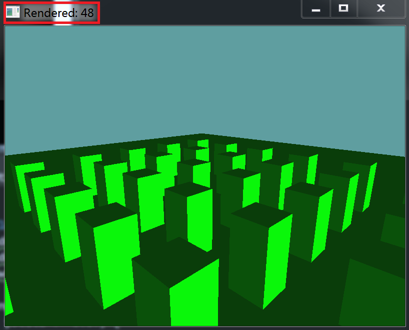

# Culling

We can now test robust enough intersections to perform vibility culling on a scene level! Whoo!!!! To achieve this, we're going to have to move the ```Rendering``` responsibility out of the ```OBJ``` class and into the ```OctreeNode``` class.

### OBJ - Render Flag

There is a slight problem in this shift of responsibility. One OBJ can belong to multiple ```OctreeNode``` objects. To make sure that only the first node that contains the ```OBJ``` actually renders it, we're going to add a new flag to the ```OBJ``` class.


```cs
protected bool wasRendered = false;
```

### OBJ - Reset Flag

Because we added a Render Flag, let's add a way to clear that flag. Still working with the ```OBJ``` class, add the following method:

```cs
public void ResetRenderFlag() {
    wasRendered = false;
}
```

### OBJ - Non Recursive Render 

The OBJ class should no longer render its-self recursivley. This is becuase the ```OctreeNode``` is going to be rendering only ```OBJ``` objects that are in view. We are changing our renderer from hierarchial traversal to spacial traversal. We're going to add a new function to ```OBJ``` to render only this object, and return true only if this is the first time the new render function was called, and something was rendered.

Additionally, this function will take in a frustum as an argument and do a narrow-phase visibility check. That is, if the ```OctreeNode``` calls this function, we know the node is visible. But that doens't mean this object is within the camera frustum. So, we do a narrow phase test between the frustum and the objects bounding sphere.

```cs
public bool NonRecursiveRender(Plane[] frustum) {
    // Is there anything to render?
    if (model == null) {
        return false;
    }

    // Already rendered once!
    if (wasRendered) {
        return false;
    }


    // Is the bounds of this obejct within the view?
    Sphere bounds = new Sphere();
    bounds.Position = new Point(
        Matrix4.MultiplyPoint(WorldMatrix, model.BoundingSphere.Position.ToVector())
    );
    float scalar = System.Math.Abs(System.Math.Max(
        System.Math.Max(
            System.Math.Abs(WorldMatrix[0, 0]), System.Math.Abs(WorldMatrix[1, 1])),
            System.Math.Abs(WorldMatrix[2, 2])));
    bounds.Radius = model.BoundingSphere.Radius * scalar;
           

    if (!Collisions.Intersects(frustum, bounds)) {
        return false;
    }

    // Cool, we can render!
    wasRendered = true;
    GL.PushMatrix();
    GL.MultMatrix(WorldMatrix.OpenGL);
    model.Render();
    GL.PopMatrix();
    return true;
}
```

### OctreeNode - Render

Add a new method to ```OctreeNode```. Call this method ```Render```. It will have the following signature:

```cs
public int Render(Plane[] frustum) {
    int total = 0;
    // TODO: Render logic for this node
    
    // TODO: Recurse trough all children
    return total;
}
```

The key here is, you can only render an OctreeNode IF you have a frustum. This happens because we will be culling the node against the frustum.

First up, the total is 0. Before doing anything, check if the ```Bounds``` of the Node are intersecting with the frustum (Frsutum V AABB). If not, just return 0.

From here on out, if we didn't return we know we have a visible node.

Next, if the ```Contents``` of the node are not null, go ahead and call the ```NonRecursiveRender``` function on each of the contents. for every ```NonRecursiveRender``` called, increment ```total``` by 1, if the drawing took place.

Lastly, if ```Children``` is not null, loop trough each of the child ```OctreeNode``` objects, and recursively call their ```Render``` functions, passing in the same frustum. Be sure to add the result of that function to the total variable.

### OctreeNode - ResetRenderFlag

Once a frame is done, we need a way to mark all objects as non-rendered. For this reason we are going to add a ```ResetRenderFlag``` function to ```OctreeNode```. This function is simple, if the node has contents (OBJ objects), it calls ```ResetRenderFlag``` on each of them. If the node has children, this ```ResetRenderFlag``` function recursivley calls its-self on each child.

```cs
public void ResetRenderFlag() {
    if (Contents != null) {
        foreach (OBJ content in Contents) {
            content.ResetRenderFlag();
        }
    }
    if (Children != null) {
        foreach (OctreeNode child in Children) {
            child.ResetRenderFlag();
        }
    }
}
```


### Unit Test

There is no real unit test, we're just going to make culling work in the ```CameraSample```.

The ```Scene``` class already contains an ```Octree```, but it's WAY too small. Find where the scene is Initialized and change it from ```scene.Initialize(7f);``` to a bigger Octree ```scene.Initialize(70f);```.

Now, just because we have an Octree, does not mean anything is in it. Change the ```AddCubeToSceneRoot``` function so that it adds cubes not only into the hierarchy, but also the octree.

```cs
void AddCubeToSceneRoot(Vector3 position, Vector3 scale) {
    scene.RootObject.Children.Add(new OBJ(cube));
    int count = scene.RootObject.Children.Count - 1;
    scene.RootObject.Children[count].Parent = scene.RootObject;
    scene.RootObject.Children[count].Position = position;
    scene.RootObject.Children[count].Scale = scale;

    // Record object with spacial partitioning tree
    scene.Octree.Insert(scene.RootObject.Children[count]);
}
```

Lastly, we need to change the ```Render``` function so that it renders the octree, instead of the root node, and that it clears render flags after the scene was drawn:

```cs
public override void Render() {
    GL.LoadMatrix(camera.ViewMatrix.OpenGL);
    DrawOrigin();

    GL.Enable(EnableCap.Lighting);
    int numRendered = scene.Octree.Render(camera.Frustum);
    scene.Octree.ResetRenderFlag();
    Window.Title = "Rendered: " + numRendered;
    GL.Disable(EnableCap.Lighting);
}
```

## Try it out
Running the game now, as you move the camera trough the world, you should see considerably less objects being drawn.

