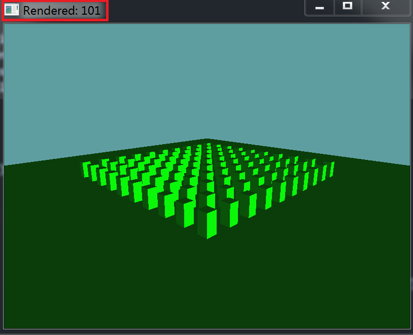

#Debug info

Before moving on, to implement a camera frustum i want to add some debug info to the scene. Nameley, i want to know how many objects are rendered. I'm actually going to provide all the code for this, just follow along. This is actually pretty simple, we start with the most basic thing that's being rendered.

In __OBJ.cs__, change the ```Render``` method of the ```OBJ``` class from this (taken from your github):

```cs
public void Render() {
    GL.PushMatrix();
    //always getter
    GL.MultMatrix(WorldMatrix.OpenGL);
    if (model != null) {
        model.Render();
    }
    GL.PopMatrix();
    ChildrenRender(true, false, false);
}
```

to this

```cs
public int Render() {
    int result = 0;
    
    GL.PushMatrix();
    GL.MultMatrix(WorldMatrix.OpenGL);
    if (model != null) {
        model.Render();
        result += 1;
    }
    GL.PopMatrix();
    
    result += ChildrenRender(true, false, false);
    return result;
}
```

All this changes is the Render function now keeps track of every time model.Render has been caleed. Of course, this means we now also have to change ```ChildrenRender``` to:

```cs
private int ChildrenRender(bool normal,bool bvh, bool debug) {
    int result = 0;
    if (Children != null) {
        foreach(OBJ child in Children) {
            if (normal) {
                result += child.Render();
            }
            else if (bvh) {
                child.RenderBVH();
            }
            else if (debug) {
                child.DebugRender();
            }
            if(child.Children != null) {
                result += child.ChildrenRender(normal, bvh, debug);
            }
        }
    }
    return result;
}
```

Now we have to go one more up the call stack and change the ```Render``` function of __Scene.cs__ to also return how many objects where rendered:

```cs
public int Render() {
    int result = RootObject.Render();

    GL.Disable(EnableCap.Lighting);
    GL.PolygonMode(MaterialFace.FrontAndBack, PolygonMode.Line);
    Octree.DebugRender();
    GL.PolygonMode(MaterialFace.FrontAndBack, PolygonMode.Fill);

    Octree.DebugRenderOnlyVisitedNodes();

    GL.Enable(EnableCap.Lighting);
    return result;
}
```

Finally, we change the __Render__ function of ```CameraSample.cs``` to display how many objects are rendered in the window title.

```cs
public override void Render() {
    GL.LoadMatrix(camera.ViewMatrix.OpenGL);
    DrawOrigin();

    GL.Enable(EnableCap.Lighting);
    int numRendered = scene.Render(false);
    Window.Title = "Rendered: " + numRendered;
    GL.Disable(EnableCap.Lighting);
}
```

If all is well, the number of rendered objects should be a constant 101.



