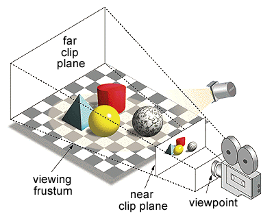

# Frustum

The frustum structure is actually an acceleration structure. It's a primitive shape (Like an AABB or any other primitive). A frustum structure is usually built out of a view matrix as a series of 6 planes.



## The Algorithm

If this all sounds a bit familiar, it should. We have actually done this exact same thing when we [made a frustum in OpenGL](https://gdbooks.gitbooks.io/legacyopengl/content/Chapter8/frustum.html).

To recap, the plane equation is

```cs
a * x + b * y + c * z + d = 0
```

To extract the planes of a frustum, you need the viewProjection matrix, which you get by multiplying the projection and view matrices together. The plane values can be found by adding or subtracting one of the first three rows of the viewProjection matrix from the fourth row.

Our camera class already has the ViewMatrix, but not the projection matrix! Let's fix that. Add the following getter to your ```Camera``` class. This getter will simply query OpenGL for the current projection matrix. This is similar to what we did in the picking example.

```cs
public Matrix4 ProjectionMatrix {
    get {
        float[] rawProjection = new float[16];
        GL.GetFloat(GetPName.ProjectionMatrix, rawProjection);
        return Matrix4.Transpose(new Matrix4(rawProjection));
    }
}
```
Now that we have the projection matrix, we can resume extracting the planes

* __Left Plane__ Row 1 (addition)
* __Right Plane__ Row 1 Negated (subtraction)
* __Bottom Plane__ Row 2 (addition)
* __Top Plane__ Row 2 Negated (subtraction)
* __Near Plane__ Row 3 (addition)
* __Far Plane__ Row 3 Negated (subtraction)

So, assuming that matrix ```mp``` is the view-projection matrix, you could get the left and right planes like so:

```cs
Matrix4 mv =  ProjectionMatrix * ViewMatrix;

Vector4 row1 = new Vector4(mv[0, 0], mv[0, 1], mv[0, 2], mv[0, 3]);
Vector4 row4 = new Vector4(mv[3, 0], mv[3, 1], mv[3, 2], mv[3, 3]);

Vector4 p1 = row4 + row1;
Vector4 p2 = row4 - row1;

Plane left = new Plane();
left.n = new Vector3();
left.n.X = p1.X;
left.n.Y = p1.Y;
left.n.Z = p1.Z;
left.d = p1.w;

Plane right = new Plane();
right.n = new Vector3();
right.n.X = p2.X;
right.n.Y = p2.Y;
right.n.Z = p2.Z;
right.d = p2.w;
```

## On Your Own

Add the ```Frustum``` getter to the ```Camera``` class

```cs
public Plane[] Frustum {
    get {
        Plane[] frustum = new Plane[6];

        // TODO: Populate all 6 planes

        return frustum;
    }
}
```

And provide an implementation for it! In order for the below unit test to pass, you have to populate your frustum as follows:

* frustum[0] = left plane
* frustum[0] = right plane
* frustum[0] = bottom plane
* frustum[0] = top plane
* frustum[0] = near plane
* frustum[0] = far plane

### Unit Test

You can [Download](../Samples/SAMPLE.rar) the samples for this chapter to see if your result looks like the unit test.

description of unit test


```cs
code
```